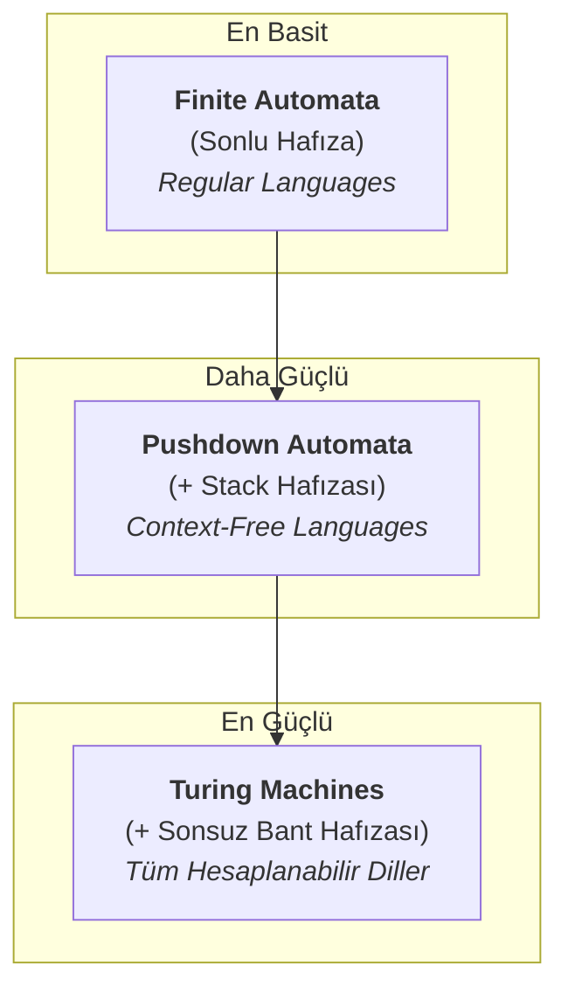

# Automata Theory: Introduction and Basic Concepts (Giriş ve Temel Kavramlar)

**Automata Theory (Otomatlar Teorisi)**, bilgisayar biliminin teorik temelini oluşturan, soyut makinelerin ve bu makinelerin çözebileceği hesaplama problemlerinin incelendiği bir alandır. Bu teori, *bir bilgisayarın temelinde ne yapabilir ve ne yapamaz?* sorusuna matematiksel bir çerçevede cevap arar.

Bu bölümde, Automata Theory'nin ne olduğunu, neden önemli olduğunu ve alanın temelini oluşturan merkezi kavramları inceleyeceğiz.

---

## 1. What is Automata Theory and Why is it Important? (Automata Teorisi Nedir ve Neden Önemlidir?)

En basit tanımıyla, Automata Theory soyut hesaplama cihazlarının (makinelerin) incelenmesidir. Bu teori, 1930'larda Alan Turing'in hesaplamanın sınırlarını tanımlama çalışmalarıyla başlamış ve 1940-50'lerde Finite Automata ve Noam Chomsky'nin Formal Grammars çalışmalarıyla gelişmiştir.

Bu teoriyi incelemek, bilgisayar biliminin kalbini anlamamızı sağlar. Uygulama alanları oldukça geniştir:
*   **Compilers (Derleyiciler):** Bir programlama dilinin kodunu analiz ederken (sözcüksel analiz, ayrıştırma).
*   **Search Engines (Arama Motorları):** Metin içinde belirli kalıpları ararken.
*   **Hardware Design (Donanım Tasarımı):** Dijital devrelerin mantığını tasarlarken.
*   **Natural Language Processing (Doğal Dil İşleme):** İnsan dilini anlamak ve işlemek için.
*   Ayrıca, hangi problemlerin **undecidable (çözülemez)** veya **intractable (içinden çıkılmaz)** olduğunu anlamamızı sağlar.

---

## 2. Central Concepts (Merkezi Kavramlar)

Automata Theory'yi anlamak için bazı temel tanımları bilmemiz gerekir.

### a) Alphabet (Alfabe)
Bir alfabe (`Σ` ile gösterilir), sembollerden oluşan **sonlu ve boş olmayan** bir kümedir.
*   **Örnekler:**
    *   İkili (Binary) Alfabe: `Σ = {0, 1}`
    *   Küçük Harf Alfabesi: `Σ = {a, b, c, ..., z}`
    *   ASCII Alfabesi

### b) String (Dizgi)
Bir dizgi (`w` ile gösterilir), bir alfabedeki sembollerin sonlu bir dizisidir.
*   **Empty String (Boş Dizgi):** `ε` (epsilon) ile gösterilir ve uzunluğu 0'dır.
*   **Uzunluk:** Bir dizginin uzunluğu `|w|` ile gösterilir. Örneğin, `|101| = 3`.

### c) Language (Dil)

Bir language (`L` ile gösterilir), belirli bir alphabet (`Σ`) üzerinden oluşturulabilecek **tüm olası string'ler kümesinin (`Σ*`) herhangi bir alt kümesidir.**
*   `Σ*` (**Sigma-star**), `Σ` alphabet'iyle oluşturulabilen tüm string'lerin (Empty String dahil) kümesidir.
*   `Σ+` (**Sigma-plus**), `Σ*`'dan tek farkı Empty String'i içermemesidir.
*   **Örnek Language'lar:**
    *   `L1 = {0ⁿ1ⁿ | n ≥ 1}`: Eşit sayıda 0 ve ardından eşit sayıda 1'den oluşan string'ler (`{01, 0011, ...}`).
    *   `L2 = Σ*`: Mümkün olan tüm string'leri içeren language.
    *   `L3 = ∅`: **Empty Language (boş dil)** (hiçbir string içermez).
    *   `L4 = {ε}`: Sadece Empty String'i içeren language.

### d) Decision Problems (Karar Problemleri)
Automata Theory'deki en temel problem türü "karar problemi"dir.
> Verilen bir `w` dizgisi, belirli bir `L` diline ait midir? (`w ∈ L?`)

Bir otomatın temel görevi, bu soruyu cevaplayan bir karar verici olarak hareket etmektir.

---

## 3. Overview of Automata (Otomatlara Genel Bakış)

Otomatlar, dilleri tanımak için kullanılan matematiksel modellerdir. Karmaşıklıklarına ve güçlerine göre artan bir hiyerarşi oluştururlar:

*Görsel: Otomat hiyerarşisi.*

---

## 4. Formal Proof Methods (Formel İspat Yöntemleri)

Automata Theory, matematiksel temellere dayandığı için çeşitli ispat yöntemleri kullanılır. Bir iddianın doğruluğunu göstermek için kullanılan başlıca yöntemler şunlardır:

*   **Deductive Proofs (Tümdengelimsel İspatlar):** Bilinen gerçeklerden (hipotezler ve aksiyomlar) yola çıkarak mantıksal çıkarım kuralları ile bir sonuca ulaşma yöntemidir.
*   **Inductive Proofs (Tümevarımsal İspatlar):** Genellikle doğal sayılar veya özyineli olarak tanımlanmış yapılar üzerinde kullanılır. Bir temel durum (basis) için doğruluğu gösterilir ve ardından `n` için doğru olduğu varsayılarak `n+1` için de doğru olduğu (inductive step) kanıtlanır.
*   **Proof by Contradiction (Çelişki ile İspat):** Bir iddianın yanlış olduğunu varsayıp bu varsayımın mantıksal bir çelişkiye yol açtığını göstererek iddianın aslında doğru olduğunu kanıtlama yöntemidir.
*   **Disproof via Counterexample (Karşı Örnek ile Çürütme):** Bir iddianın genel olarak doğru olmadığını, o iddiayı sağlamayan tek bir örnek göstererek kanıtlamaktır.

---

  
<b>Soru 1:</b> `Σ = {a, b}` alfabesi verildiğinde, aşağıdakilerden hangisi `Σ*` kümesinin bir elemanı <b>değildir</b>?

  
A) `ababa`

  
B) `ε` (boş string)

  
C) `a c`

  
D) `bbbb`

  

    
<b>Cevap: C.</b> `Σ*`, `Σ` alfabesindeki sembollerden (`a` ve `b`) oluşan tüm sonlu dizgileri içerir. `a c` string'i, alfabe dışı bir sembol olan `c`'yi içerdiği için `Σ*` kümesine ait değildir.

  

