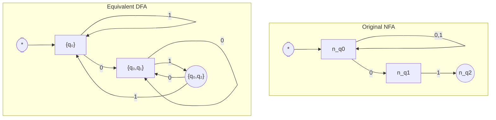

# Nondeterministic Finite Automata (NFA)

DFA'lar, her state ve her symbol için tek bir sonraki adıma sahip olmalarıyla "belirleyici" (deterministic) idi. Şimdi ise daha esnek ve güçlü bir model olan **Nondeterministic Finite Automaton (Belirleyici Olmayan Sonlu Otomat)**, yani **NFA**'yı inceleyeceğiz.

"Belirleyici olmama" (nondeterminism), bir NFA'nın belirli bir state'te belirli bir symbol'ü okuduğunda, birden fazla olası sonraki state'e gidebilmesi veya hiçbir yere gitmemesi anlamına gelir. Hatta, hiçbir symbol okumadan da state değiştirebilirler!

---

## 1. NFA'nın DFA'dan Farkları

Bir NFA, üç temel yeteneğiyle DFA'dan ayrılır:

1.  **Çoklu Transition (Multiple Transitions):** Bir state'ten, aynı giriş symbol'ü için birden fazla farklı state'e transition olabilir.
2.  **Eksik Transition (Missing Transitions):** Bir state'te, belirli bir symbol için tanımlanmış hiçbir transition olmayabilir. Bu yola giren string "sıkışır" ve reddedilir.
3.  **Epsilon Transition'ları (ε-Transitions):** Bir NFA, hiçbir giriş symbol'ü okumadan (`ε` ile) state değiştirebilir. Bu, bir state'ten diğerine "bedava" transition yapabilmesini sağlar.

Bu esneklik, belirli language'ları DFA'lara göre çok daha basit ve daha az state ile ifade etmeyi mümkün kılar.

*Görsel: Sonu `01` ile biten tüm string'leri (`01`, `001`, `1101`, vs.) kabul eden bir NFA. `q₀`'dan `0` okunduğunda hem `q₀`'da kalıp hem de `q₁`'e gidebilmesi, "belirleyici olmama" durumunun bir örneğidir.*

```mermaid
graph LR
    direction LR
    
    [*] --> q0
    
    q0 -- "0,1" --> q0
    q0 -- "0" --> q1
    q1 -- "1" --> q2((q2))
```

---

## 2. NFA'nın Formel Tanımı

Bir NFA da DFA gibi 5'li bir demet ile tanımlanır: `A = (Q, Σ, δ, q₀, F)`. Ancak tek ve en önemli fark **transition function `δ`**'nın tanımındadır.

*   **DFA'da:** `δ: Q × Σ → Q` (Bir state ve bir symbol, tek bir sonraki state'i verir)
*   **NFA'da:** `δ: Q × (Σ ∪ {ε}) → P(Q)` (Bir state ve bir symbol (veya ε), bir **states kümesini (set of states)** verir)

Buradaki `P(Q)`, `Q` kümesinin **Power Set (kuvvet kümesi)**, yani `Q`'nun tüm olası alt kümelerinin kümesidir. Bu tanım, bir transition'ın sonucunun tek bir state değil, bir states kümesi (hiç state içermeyen boş küme dahil) olabileceğini gösterir.

---

## 3. NFA Bir `String`'i Nasıl Kabul Eder?

DFA'da bir string'i işlerken takip edilecek tek bir yol vardı. NFA'da ise, çoklu transition'lar ve ε-transition'ları nedeniyle bir string için birden fazla olası "hesaplama yolu" olabilir.

Bir NFA, bir `w` string'ini şu koşulda **kabul eder**:
> `w` string'inin tamamı okunduktan sonra, mümkün olan tüm yollardan **en az bir tanesi** bir kabul state'inde (`F`'nin bir elemanı) sonlanıyorsa.

Makine, sanki tüm olası yolları aynı anda keşfediyormuş gibi düşünülebilir. Eğer bu yollardan herhangi biri başarıya (kabul state'ine) ulaşırsa, string kabul edilir. Hepsi başarısız olursa (red state'lerinde sonlanırsa veya yolda sıkışırsa), string reddedilir.

### ε-Closure Kavramı
`ECLOSE(q)` (epsilon-closure), bir `q` state'inden başlayarak sadece ε-transition'ları kullanılarak ulaşılabilecek tüm state'lerin kümesidir (q'nun kendisi dahil). Bu kavram, NFA'nın bir symbol'ü okuduktan sonra gidebileceği tüm "bedava" yolları hesaplamak için kullanılır.

---

## 4. NFA'nın Gücü ve Eşdeğerlik

NFA'lar daha esnek ve genellikle daha sezgisel görünse de, hesaplama gücü olarak DFA'lardan daha güçlü **değildirler**. Bu, otomatlar teorisindeki en önemli sonuçlardan biridir:

> Bir language, bir NFA tarafından tanınabiliyorsa, o zaman o language'ı tanıyan bir DFA da mutlaka vardır (ve tersi).

Her NFA, **Subset Construction (Alt Küme İnşası)** adı verilen bir algoritma ile eşdeğer bir DFA'ya dönüştürülebilir. Bu işlem, NFA'nın aynı anda bulunabileceği tüm state'lerin kombinasyonlarını, DFA için tek bir state olarak ele alır. Ancak bu dönüşüm sonucunda state sayısı katlanarak artabilir (en kötü durumda `n` state'li bir NFA, `2ⁿ` state'li bir DFA'ya dönüşebilir).

Bu nedenle, NFA ve DFA'lar aynı language sınıfını tanır: **Regular Languages (Düzenli Diller)**.

---

## 5. Örnek: NFA'dan DFA'ya Dönüşüm (Subset Construction)

Yukarıda sonu `01` ile biten stringleri tanıyan NFA'yı ele alalım. Adım adım bu NFA'yı eşdeğer bir DFA'ya dönüştürelim.

**Adım 1: Başlangıç Durumu**
DFA'nın başlangıç durumu, NFA'nın başlangıç durumunun Epsilon-Closure'ı (`ECLOSE(q₀)`) ile başlar.
*   NFA başlangıç durumu: `{q₀}`
*   DFA başlangıç durumu: `A = ECLOSE({q₀}) = {q₀}`

**Adım 2: Yeni Durumları Keşfetme**
`A={q₀}` durumundan alfabedeki her sembol (`0` ve `1`) için geçişleri hesaplayalım.
*   **`A`'dan `0` okunduğunda:**
    *   `δ(q₀, 0) = {q₀, q₁}`
    *   Yeni DFA durumu: `B = {q₀, q₁}`
*   **`A`'dan `1` okunduğunda:**
    *   `δ(q₀, 1) = {q₀}`
    *   Yani `A` durumuna geri döner.

**Adım 3: Yeni Durumlar İçin Geçişler**
Şimdi yeni `B={q₀, q₁}` durumu için geçişleri hesaplayalım.
*   **`B`'den `0` okunduğunda:**
    *   `δ(q₀, 0) ∪ δ(q₁, 0) = {q₀, q₁} ∪ ∅ = {q₀, q₁}`
    *   Yani `B` durumuna geri döner.
*   **`B`'den `1` okunduğunda:**
    *   `δ(q₀, 1) ∪ δ(q₁, 1) = {q₀} ∪ {q₂} = {q₀, q₂}`
    *   Yeni DFA durumu: `C = {q₀, q₂}`

**Adım 4: Son Durum İçin Geçişler**
Son olarak yeni `C={q₀, q₂}` durumu için geçişleri hesaplayalım.
*   **`C`'den `0` okunduğunda:**
    *   `δ(q₀, 0) ∪ δ(q₂, 0) = {q₀, q₁} ∪ ∅ = {q₀, q₁}`
    *   Yani `B` durumuna gider.
*   **`C`'den `1` okunduğunda:**
    *   `δ(q₀, 1) ∪ δ(q₂, 1) = {q₀} ∪ ∅ = {q₀}`
    *   Yani `A` durumuna gider.

**Adım 5: Kabul Durumlarını Belirleme**
NFA'nın kabul durumu olan `q₂`'yi içeren tüm DFA durumları, yeni DFA'nın kabul durumları olur.
*   `C = {q₀, q₂}` durumu `q₂`'yi içerdiği için kabul durumudur.

**Sonuç:**

*Görsel: Soldaki NFA'nın, Subset Construction algoritması ile sağdaki eşdeğer DFA'ya dönüşümü.*



---

<div class="quiz-question">
  <p><b>Soru 1:</b> Aşağıdakilerden hangisi bir NFA'nın yapabileceği ancak bir DFA'nın yapamayacağı bir eylemdir?</p>
  <div class="quiz-option">A) Bir başlangıç state'inden başlamak.</div>
  <div class="quiz-option">B) Bir string'i okuduktan sonra kabul state'inde sonlanmak.</div>
  <div class="quiz-option" data-correct="true">C) Hiçbir symbol okumadan (`ε` ile) state değiştirmek.</div>
  <div class="quiz-option">D) Alfabedeki bir symbol'ü okuyarak state değiştirmek.</div>
  <div class="quiz-explanation">
    <p><b>Cevap: C.</b> Epsilon (`ε`) transition'ları, NFA'ların belirleyici olmayan doğasının bir parçasıdır ve DFA'larda bulunmazlar. Bu, NFA'ların hiçbir girdi almadan state değiştirmesine olanak tanır.</p>
  </div>
</div>

<div class="quiz-question">
  <p><b>Soru 2:</b> Bir NFA, `w = 010` string'ini işledikten sonra olası tüm yolların sonunda `{q₁, q₃, q₅}` state'lerinde bulunuyor. DFA'nın kabul state'leri kümesi `F = {q₄, q₅}` ise, string kabul edilir mi?</p>
  <div class="quiz-option" data-correct="true">A) Evet, çünkü olası son state'lerden en az biri (`q₅`) kabul state'leri kümesine aittir.</div>
  <div class="quiz-option">B) Hayır, çünkü tüm olası son state'ler (`q₁`, `q₃`, `q₅`) kabul state'leri kümesine ait değildir.</div>
  <div class="quiz-option">C) Belirsizdir, çünkü NFA'lar deterministik değildir.</div>
  <div class="quiz-option">D) Hayır, çünkü `q₁` ve `q₃` kabul state'i değildir.</div>
  <div class="quiz-explanation">
    <p><b>Cevap: A.</b> Bir NFA'nın bir string'i kabul etmesi için, olası hesaplama yollarından sadece bir tanesinin bile bir kabul state'inde bitmesi yeterlidir. `q₅` bir kabul state'i olduğu için string kabul edilir.</p>
  </div>
</div>

<div class="quiz-question">
  <p><b>Soru 3:</b> NFA'ların hesaplama gücü DFA'lara kıyasla nasıldır?</p>
  <div class="quiz-option">A) NFA'lar DFA'lardan daha güçlüdür.</div>
  <div class="quiz-option">B) DFA'lar NFA'lardan daha güçlüdür.</div>
  <div class="quiz-option" data-correct="true">C) NFA'lar ve DFA'lar eşdeğer hesaplama gücüne sahiptir.</div>
  <div class="quiz-option">D) Bazı language'ları sadece NFA'lar tanıyabilir.</div>
  <div class="quiz-explanation">
    <p><b>Cevap: C.</b> Her NFA, eşdeğer bir DFA'ya dönüştürülebildiği için, iki model de aynı language sınıfını, yani Düzenli Dilleri (Regular Languages) tanır. NFA'lar genellikle daha az state ile daha öz bir gösterim sunsa da, bu onların daha "güçlü" olduğu anlamına gelmez.</p>
  </div>
</div>
