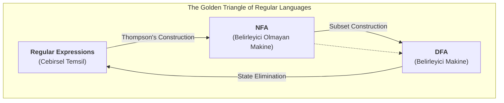

# Regular Expressions (Düzenli İfadeler)

Şimdiye kadar, Regular Languages (Düzenli Dilleri) tanıyan makineleri, yani DFA ve NFA'ları inceledik. Şimdi ise bu language'ları cebirsel bir yolla tanımlamak ve oluşturmak için kullanılan güçlü bir notasyon olan **Regular Expressions (Düzenli İfadeler)**, kısaca **RE**'leri öğreneceğiz.

Düzenli ifadeler, bir metin editöründe "bul ve değiştir" yaparken veya bir terminalde dosya ararken (`ls *.txt`) kullandığımız kalıp eşleştirme (pattern matching) kurallarının teorik temelidir.

---

## 1. Regular Languages ve Regular Expressions Arasındaki İlişki

Bu üç kavram arasında çok güçlü ve temel bir bağlantı vardır:
*   Her düzenli ifade (`E`), bir regular language'ı (`L(E)`) tanımlar.
*   Her regular language, bir NFA (ve dolayısıyla bir DFA) tarafından tanınabilir.
*   Her regular language, bir düzenli ifade ile tanımlanabilir.

Kısacası, **DFA'lar, NFA'lar ve Düzenli İfadeler, aynı language sınıfını (Regular Languages) tanımlamanın üç farklı yoludur.**

*Görsel: Düzenli Dilleri Temsil Etmenin "Altın Üçgeni". Her köşe, aynı güce sahip farklı bir temsil yöntemidir ve aralarında sistematik dönüşüm algoritmaları vardır.*
{: .text-center }

{: .d-block .mx-auto }

---

## 2. Language'lar Üzerindeki İşlemler

Düzenli ifadeleri anlamak için, language'lar üzerinde tanımlı üç temel işlemi bilmemiz gerekir:

1.  **Union (Birleşim):** `L ∪ M` veya `L + M`. `L` veya `M` language'ına ait tüm string'leri içeren language'dır.
2.  **Concatenation (Birleştirme):** `LM`. `L`'den bir `x` string'i ile `M`'den bir `y` string'inin art arda eklenmesiyle (`xy`) oluşan tüm string'leri içeren language'dır.
3.  **Kleene Star (Kleene Yıldızı):** `L*`. `L` language'ındaki string'lerin sıfır veya daha fazla kez birleştirilmesiyle (kendisiyle concatenate edilmesiyle) oluşturulabilecek tüm string'leri içeren language'dır. `L*` her zaman boş string'i (`ε`) içerir.

---

## 3. Düzenli İfadelerin Tanımı

Düzenli ifadeler, temel ifadelerden ve bu üç işlemden türetilir:

| Kural | Düzenli İfade | Tanımladığı Language | Açıklama |
| :--- | :--- | :--- | :--- |
| **Temel** | `∅` | `{}` (**Empty Language (Boş Dil)**) | Hiçbir string içermeyen language. |
| | `ε` | `{ε}` | Sadece boş string'i içeren language. |
| | `a` (eğer `a ∈ Σ` ise) | `{a}` | Sadece 'a' symbol'ünü içeren language. |
| **Türetme** | `E₁ + E₂` | `L(E₁) ∪ L(E₂)` | İki ifadenin language'larının birleşimi. |
| | `E₁E₂` | `L(E₁)L(E₂)` | İki ifadenin language'larının birleştirilmesi. |
| | `E*` | `(L(E))*` | Bir ifadenin language'ının Kleene yıldızı. |
| | `(E)` | `L(E)` | Gruplama için parantezler. |

**Operatör Önceliği:** `*` (en yüksek) > Concatenation > `+` (en düşük). Örneğin, `a+bc*` ifadesi `a + (b(c*))` olarak yorumlanır.

---

## 4. Dönüşümler

### a) Düzenli İfadeden NFA'ya (Thompson's Construction)
Herhangi bir düzenli ifade, parçalara ayrılarak ve her parça için basit NFA'lar oluşturulup sonra bu NFA'ların `ε`-geçişleri ile birleştirilmesiyle sistematik olarak eşdeğer bir NFA'ya dönüştürülebilir.
*   **Temel:** `∅`, `ε`, ve tek bir `a` sembolü için basit 2 durumlu NFA'lar vardır.
*   **Türetme:** `E₁ + E₂`, `E₁E₂` ve `E*` işlemleri için, alt ifadelerin NFA'larını `ε`-geçişleri ile birleştiren standart şablonlar kullanılır.

### b) DFA'dan Düzenli İfadeye (State Elimination)
Bu dönüşüm daha karmaşıktır ve genellikle durum eleme (state elimination) yöntemiyle yapılır. Süreç, **Genelleştirilmiş NFA (GNFA)** adı verilen ve geçiş etiketlerinin düzenli ifade olabildiği bir otomat türü kullanır.

**Adımlar:**
1.  **DFA'yı GNFA'ya Dönüştürme:**
    *   Orijinal başlangıç durumuna `ε`-geçişi olan yeni bir başlangıç durumu eklenir.
    *   Orijinal kabul durumlarından `ε`-geçişleri olan yeni ve tek bir kabul durumu eklenir.
    *   Tüm geçiş etiketleri düzenli ifadelere dönüştürülür (örneğin, `a` ve `b` için iki ayrı geçiş `a+b` olur).
2.  **Durumları Sistematik Olarak Eleme:**
    *   Başlangıç ve bitiş durumları hariç, durumlar birer birer elenir.
    *   Bir `qₖ` durumu elendiğinde, `qᵢ` durumundan `qⱼ` durumuna `qₖ` üzerinden geçen yolların yerine yeni bir geçiş eklenir. Bu yeni geçişin etiketi, eski yolları temsil eden yeni bir düzenli ifadedir.
3.  **Sonuç:** Sadece başlangıç ve bitiş durumu kaldığında, aralarındaki tek geçişin etiketi, orijinal DFA'nın tanıdığı dilin düzenli ifadesidir.

**Durum Eleme Formülü:**
Bir `qₖ` durumu elenirken, herhangi bir `qᵢ` durumundan `qⱼ` durumuna olan geçişin yeni düzenli ifadesi (`R'ᵢⱼ`) şu formülle hesaplanır:

`R'ᵢⱼ = Rᵢⱼ + Rᵢₖ(Rₖₖ)*Rₖⱼ`

Burada:
*   `Rᵢⱼ`: `qᵢ`'den `qⱼ`'ye olan mevcut ifadedir.
*   `Rᵢₖ`: `qᵢ`'den `qₖ`'ye olan ifadedir.
*   `Rₖₖ`: `qₖ`'den kendine olan döngünün ifadesidir.
*   `Rₖⱼ`: `qₖ`'den `qⱼ`'ye olan ifadedir.

---

## 5. Düzenli İfadelerin Cebirsel Kuralları

Düzenli ifadeler, üzerinde tanımlı cebirsel kurallara sahiptir. Bu kurallar, bir ifadeyi basitleştirmek veya farklı görünen iki ifadenin aslında aynı language'ı tanımlayıp tanımlamadığını anlamak için kullanılır.

*   **Union (Birleşme) Değişme ve Birleşme Özelliği:**
    *   `L + M = M + L` (**Commutative (Değişme)**)
    *   `L + (M + N) = (L + M) + N` (**Associative (Birleşme)**)
*   **Concatenation (Birleştirme) Birleşme Özelliği:**
    *   `L(MN) = (LM)N` (**Associative (Birleşme)**)
    *   Ancak birleştirme işleminin değişme özelliği yoktur: `LM ≠ ML`
*   **Distributive (Dağılma) Özelliği:**
    *   `L(M + N) = LM + LN`
    *   `(M + N)L = ML + NL`
*   **Identities (Etkisiz Elemanlar):**
    *   Birleşme için: `L + ∅ = L`
    *   Birleştirme için: `Lε = εL = L`
*   **Annihilator (Yutan Eleman):**
    *   Birleştirme için: `L∅ = ∅L = ∅`
*   **Idempotence (Kendine Dönüş):**
    *   `L + L = L`
*   **Closure (Yıldız) Kuralları:**
    *   `(L*)* = L*`
    *   `∅* = ε`
    *   `ε* = ε`

---

  
<b>Soru 1:</b> `Σ = {0, 1}` alfabesi için `0(0+1)*1` düzenli ifadesi hangi language'ı tanımlar?

  
A) İçinde "01" geçen tüm string'ler.

  
B) '0' ile başlayıp '1' ile biten tüm string'ler.

  
C) '0' ve '1' sayılarının eşit olduğu tüm string'ler.

  
D) Sadece "01" string'i.

  

    
<b>Cevap: B.</b> İfadeyi parçalara ayıralım: `0` (bir '0' ile başlamalı), `(0+1)*` (ortada '0' veya '1'den oluşan herhangi bir string olabilir), `1` ('1' ile bitmeli).

  

  
<b>Soru 2:</b> `(a+b)*` düzenli ifadesinin Kleene yıldızı, yani `((a+b)*)*` ifadesinin en basit eşdeğeri nedir?

  
A) `(a*+b*)*`

  
B) `a*b*`

  
C) `(a+b)*`

  
D) `(ab)*`

  

    
<b>Cevap: C.</b> Bir ifadenin yıldızının tekrar yıldızını almak, language'a bir şey eklemez. `(a+b)*` zaten 'a' ve 'b'den oluşan tüm olası string'leri içerir. Bu kümenin tekrar yıldızını almak aynı kümeyi verir. Bu, `(L*)* = L*` cebirsel kuralıdır.

  

  
<b>Soru 3:</b> Düzenli ifadeler ve sonlu otomatlar (DFA/NFA) arasındaki ilişki için aşağıdakilerden hangisi doğrudur?

  
A) Her düzenli ifade bir DFA'ya dönüştürülebilir ama her DFA bir düzenli ifadeye dönüştürülemez.

  
B) Düzenli ifadeler, NFA'ların tanıyamadığı language'ları de tanımlayabilir.

  
C) Bir language'ın düzenli ifade ile tanımlanabilmesi, o language'ın bir sonlu otomat tarafından tanınabilmesine denktir.

  
D) Düzenli ifadeler sadece metin arama için kullanılır ve teorik bir karşılıkları yoktur.

  

    
<b>Cevap: C.</b> Bu, teorinin temel sonucudur (Kleene's Theorem). Düzenli ifadeler ve sonlu otomatlar, Düzenli Dilleri (Regular Languages) tanımlamanın eşdeğer yollarıdır.

  

