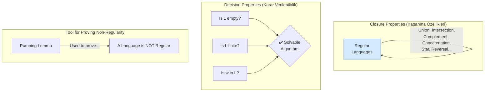

# Properties of Regular Languages (Düzenli Dillerin Özellikleri)

Şimdiye kadar regular languages'ı üç farklı yolla tanımladık: DFA'lar, NFA'lar ve Düzenli İfadeler. Bu bölümde, bu language sınıfının sahip olduğu temel özellikleri ve bu özelliklerin bize ne gibi yetenekler kazandırdığını inceleyeceğiz. Bu özellikler, bir language'ın düzenli olup olmadığını anlamamızı, otomatları optimize etmemizi ve language'lar hakkında algoritmik olarak sorular sormamızı sağlar.

*Görsel: Düzenli Dillerin temel özellikleri. Bu language ailesi, birçok işlem altında "kapalıdır", onlar hakkında kritik sorular algoritmik olarak cevaplanabilir ve düzenli olmadıklarını kanıtlamak için güçlü bir aracımız (Pumping Lemma) vardır.*



---

## 1. DFA Minimization (DFA Minimizasyonu)

Aynı regular language'ı tanıyan sonsuz sayıda farklı DFA olabilir. Ancak, bu language için **mümkün olan en az sayıda state'e sahip** ve **benzersiz** (sadece state adları farklı olabilir) bir DFA her zaman vardır. Bir DFA'yı bu en verimli haline getirme işlemine **minimizasyon** denir.

Bu işlem, "ayırt edilemez" (indistinguishable) state'lerin birleştirilmesine dayanır. İki state, onlardan başlayarak okunan herhangi bir string'in her ikisini de ya kabul ya da red state'ine götürmesi durumunda ayırt edilemez olarak kabul edilir ve birleştirilebilir. Bu, genellikle **Table-Filling Algorithm** ile yapılır.

*Görsel: Soldaki DFA'da `q₂` ve `q₄` durumları ayırt edilemezdir (her ikisinden de `b` okunduğunda kabul durumuna gidilir, diğer durumlarda ise sıkışıp kalırlar). Bu nedenle, bu iki durum sağdaki minimize edilmiş DFA'da `q₂₄` olarak birleştirilmiştir.*

```mermaid
graph TD
    subgraph "Original DFA"
        [*] --> q0
        q0 -- "a" --> q1
        q1 -- "b" --> q2((q2))
        q0 -- "a" --> q3
        q3 -- "b" --> q4((q4))
    end

    subgraph "Minimized DFA"
        [*] --> m_q0
        m_q0 -- "a" --> m_q13
        m_q13 -- "b" --> m_q24((q24))
    end
```

---

## 2. Closure Properties (Kapanma Özellikleri)

Bir language ailesinin bir işlem altında "kapalı" olması, o aileden language'larla bu işlemi yaptığınızda sonucun yine aynı aileden bir language olması demektir. Regular languages, birçok önemli işlem altında kapalıdır:

*   **Union (Birleşim):** İki regular language'ın birleşimi de düzenlidir.
*   **Concatenation (Birleştirme):** İki regular language'ın birleştirilmesi de düzenlidir.
*   **Kleene Star (Kleene Yıldızı):** Bir regular language'ın Kleene yıldızı da düzenlidir.
*   **Complement (Tümleme):** Bir regular language'ın tümleyeni (alfabedeki o language'a ait olmayan tüm string'ler) de düzenlidir. *Kanıt: DFA'daki kabul ve red state'lerini birbiriyle değiştirin.*
*   **Intersection (Kesişim):** İki regular language'ın kesişimi de düzenlidir. *Kanıt: `L ∩ M = ¬(¬L ∪ ¬M)` (De Morgan Kuralı).*
*   **Difference (Fark):** `L - M` de düzenlidir.
*   **Reversal (Ters Çevirme):** Bir language'daki tüm string'lerin ters çevrilmiş hali de düzenlidir.
*   **Homomorfizma (Homomorphism):** Bir `h` homomorfizması, bir alfabedeki her sembolü bir string ile eşleyen bir fonksiyondur. Eğer `L` düzenli bir dil ise, `h(L)` (yani `L`'deki her string'e `h` fonksiyonunun uygulanmasıyla oluşan dil) de düzenlidir.
*   **Ters Homomorfizma (Inverse Homomorphism):** `h⁻¹(L)`, `h` fonksiyonu uygulandığında `L` diline ait bir string üreten tüm string'lerin kümesidir. Eğer `L` düzenli ise, `h⁻¹(L)` de her zaman düzenlidir.

Bu özellikler, karmaşık regular language'ları daha basit regular language'lardan inşa edebileceğimiz anlamına gelir.

<div class="quiz-question">
  <p><b>Soru 1:</b> Regular languages'ın "kesişim" (intersection) altında kapalı olması ne anlama gelir?</p>
  <div class="quiz-option">A) İki regular language'ın kesişimi her zaman boş kümedir.</div>
  <div class="quiz-option" data-correct="true">B) `L` ve `M` regular language ise, `L ∩ M` language'ı de her zaman düzenlidir.</div>
  <div class="quiz-option">C) Bir regular language kendisiyle kesiştiğinde yine kendisini verir.</div>
  <div class="quiz-option">D) İki DFA'yı kesiştirmek mümkün değildir.</div>
  <div class="quiz-explanation">
    <p><b>Cevap: B.</b> Kapanma özelliği, bir işlem uygulandıktan sonra sonucun yine aynı küme (bu durumda regular languages kümesi) içinde kalması demektir.</p>
  </div>
</div>

---

## 3. Decision Properties (Karar Verilebilirlik Özellikleri)

Regular languages'ın bir diğer güçlü özelliği, onlar hakkında sorulan birçok önemli sorunun algoritmik olarak **karar verilebilir** olmasıdır. Yani, bu soruları cevaplayan ve her zaman sonlanan bir algoritma vardır.

*   **Emptiness Problem (Boşluk Problemi):** Bir regular language `L` boş mu? (`L = ∅?`) *Çözüm: DFA'nın başlangıç state'inden herhangi bir kabul state'ine bir yol olup olmadığını kontrol et.*
*   **Finiteness Problem (Sonluluk Problemi):** Bir regular language `L` sonlu sayıda mı string içeriyor? *Çözüm: DFA'nın state diyagramında, başlangıç state'inden ulaşılabilen ve bir kabul state'ine gidebilen bir döngü (cycle) olup olmadığını kontrol et.*
*   **Membership Problem (Üyelik Problemi):** Bir `w` string'i, `L` language'ına ait mi? (`w ∈ L?`) *Çözüm: DFA'da `w` string'ini çalıştır ve kabul state'inde bitip bitmediğine bak.*
*   **Equivalence Problem (Eşitlik Problemi):** İki düzenli dil `L` ve `M` birbirine eşit mi? (`L = M?`) *Çözüm: `(L ∩ ¬M) ∪ (¬L ∩ M)` dilinin boş olup olmadığını kontrol et. Bu dil boş ise, iki dil birbirine eşittir.*
*   **Subset Problem (Alt Küme Problemi):** `L` dili, `M` dilinin bir alt kümesi mi? (`L ⊆ M?`) *Çözüm: `L ∩ ¬M` dilinin boş olup olmadığını kontrol et. Bu dil boş ise, `L`, `M`'nin bir alt kümesidir.*

<div class="quiz-question">
  <p><b>Soru 3:</b> Bir DFA'nın tanıdığı language'ın **sonsuz** olup olmadığına nasıl karar verilir?</p>
  <div class="quiz-option" data-correct="true">A) State diyagramında başlangıç state'inden ulaşılabilen ve bir kabul state'ine götüren bir döngü (cycle) varsa.</div>
  <div class="quiz-option">B) DFA'nın en az bir kabul state'i varsa.</div>
  <div class="quiz-option">C) State sayısı belirli bir eşiği aşıyorsa.</div>
  <div class="quiz-option">D) NFA'ya dönüştürüldüğünde epsilon transition'ları içeriyorsa.</div>
  <div class="quiz-explanation">
    <p><b>Cevap: A.</b> Eğer böyle bir döngü varsa, bu döngü etrafında istenildiği kadar dönülerek sonsuz sayıda farklı ve geçerli string üretilebilir. Eğer böyle bir döngü yoksa, tanınan language'daki string'lerin uzunluğu sınırlıdır ve language sonludur.</p>
  </div>
</div>

---

## 4. The Pumping Lemma for Regular Languages

Pumping Lemma, bir language'ın düzenli **olmadığını** kanıtlamak için kullanılan en önemli araçtır. Doğrudan bir language'ın düzenli olduğunu kanıtlamak için kullanılamaz.

**Teorem:** Eğer `L` regular bir language ise, o zaman öyle bir `n` "pompalama uzunluğu" (pumping length) sabiti vardır ki, `L` içindeki `|w| ≥ n` olan herhangi bir `w` string'i üç parçaya ayrılabilir: `w = xyz`, ve şu koşulları sağlar:
1.  `|y| > 0` (orta kısım boş olamaz).
2.  `|xy| ≤ n` (ilk iki parçanın toplam uzunluğu `n`'yi geçemez).
3.  Tüm `k ≥ 0` için, `xyᵏz` string'i de `L`'ye aittir. (`y` parçasını 0 veya daha fazla kez "pompalayabiliriz" ve sonuç hep language'da kalır).

Bu teorem, yeterince uzun bir string'in bir DFA'da işlenirken mutlaka bir state'i tekrar etmesi (bir döngüye girmesi) gerektiği fikrine dayanır. İşte bu döngü, "pompalanabilen" `y` parçasına karşılık gelir.

**Uygulama:** Bir language'ın düzenli olmadığını göstermek için, çelişki ile ispat yöntemi kullanılır. Language'ın düzenli olduğunu varsayarız, Pumping Lemma'yı uygularız ve `y` parçasını pompalayarak language'ın tanımını bozan bir string elde ederiz. Bu çelişki, başlangıç varsayımımızın (language'ın düzenli olduğu) yanlış olduğunu gösterir.

**Klasik Örnek:** `L = {0ⁿ1ⁿ | n ≥ 0}` language'ı düzenli değildir. Çünkü `y` parçasını pompaladığımızda 0 ve 1'lerin sayısı eşit olmaz, bu da language'ın tanımını bozar.

---

<div class="quiz-question">
  <p><b>Soru 2:</b> Pumping Lemma en yaygın olarak ne için kullanılır?</p>
  <div class="quiz-option">A) Bir language'ın düzenli olduğunu ispatlamak için.</div>
  <div class="quiz-option">B) Bir DFA'yı NFA'ya dönüştürmek için.</div>
  <div class="quiz-option" data-correct="true">C) Bir language'ın düzenli olmadığını ispatlamak için.</div>
  <div class="quiz-option">D) Bir DFA'yı minimize etmek için.</div>
  <div class="quiz-explanation">
    <p><b>Cevap: C.</b> Pumping Lemma, bir language'ın düzenli olduğu varsayımı altında, o language'ın sahip olması gereken bir "pompalama" özelliğini belirtir. Eğer language bu özelliği sağlamıyorsa (çelişki bulunursa), o zaman language düzenli olamaz.</p>
  </div>
</div>
