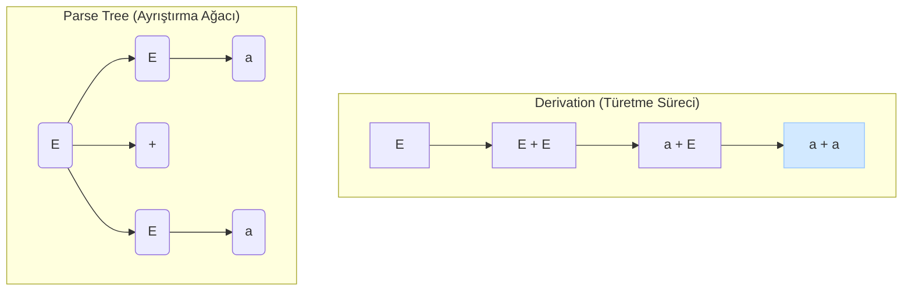

# Context-Free Grammars (Bağlamdan Bağımsız Dilbilgisi)

Önceki bölümlerde, Regular Languages (Düzenli Diller) sınıfını ve bunları tanıyan Finite Automata (Sonlu Otomatlar)'yı inceledik. Ancak, programlama dillerindeki iç içe geçmiş yapılar (parantezler, `if-else` blokları) veya `L = {0ⁿ1ⁿ}` gibi language'lar, finite automata'nın sınırlı hafızası tarafından tanınamaz.

Bu daha karmaşık language'ları tanımlamak için daha güçlü bir araca ihtiyacımız var: **Context-Free Grammars (Bağlamdan Bağımsız Dilbilgisi)**, kısaca **CFG**. CFG'ler, bir language'ın sözdizimsel (syntactic) yapısını ve kurallarını tanımlamak için kullanılır ve **Context-Free Languages (CFL)** olarak bilinen daha geniş bir language sınıfını oluştururlar.

---

## 1. CFG'nin Formel Tanımı

Bir CFG, matematiksel olarak 4 elemanlı bir demet (4-tuple) ile ifade edilir: `G = (V, T, P, S)`

1.  **V:** **Variables (Değişkenler)** veya *non-terminals* olarak adlandırılan sonlu bir küme. Genellikle büyük harflerle gösterilirler (Örn: `E`, `T`, `F`). Bunlar, language'ın daha küçük parçalarını temsil eden ara symbol'lerdir.
2.  **T:** **Terminals (Terminaller)** olarak adlandırılan, alphabet'i oluşturan symbol'lerin sonlu bir kümesi. Genellikle küçük harfler, sayılar veya symbol'lerle gösterilirler (Örn: `a`, `b`, `0`, `1`, `+`, `*`). Bunlar, language'daki nihai string'leri oluşturan temel yapı taşlarıdır.
3.  **P:** **Productions (Kurallar)** veya *rules* olarak adlandırılan sonlu bir küme. Her kural, bir variable'ın hangi terminal ve variable kombinasyonlarına dönüşebileceğini belirtir. `A → α` şeklinde gösterilir, burada `A` bir variable, `α` ise variable ve terminal'lerden oluşan bir string'dir.
4.  **S:** **Start Symbol (Başlangıç Sembolü)**. `S ∈ V` olmalıdır ve tüm türetme işlemleri bu symbol'den başlar.

"Bağlamdan bağımsız" (context-free) terimi, kuralların sol tarafında her zaman tek bir variable olmasından gelir. Yani, `A` variable'ı, etrafında hangi symbol'ler (bağlam) olursa olsun, her zaman aynı şekilde `α`'ya dönüşebilir.

---

## 2. Derivations (Türetme) ve Parse Trees (Ayrıştırma Ağaçları)

Bir CFG'nin bir language'ı nasıl ürettiğini anlamak için **derivation (türetme)** sürecini kullanırız. Bu süreç, start symbol `S` ile başlar ve bir kuralı tekrar tekrar uygulayarak, sadece terminal symbol'lerden oluşan bir string elde edene kadar devam eder.

**Örnek:** Basit bir aritmetik ifade grameri `G`:
*   `V = {E}`
*   `T = {a, +, *}`
*   `S = E`
*   `P:`
    1.  `E → E + E`
    2.  `E → E * E`
    3.  `E → a`

Bu gramerden `a+a*a` string'ini türetelim:
`E ⇒ E + E` (Kural 1)
`⇒ a + E` (Kural 3, soldaki E'ye)
`⇒ a + E * E` (Kural 2, sağdaki E'ye)
`⇒ a + a * E` (Kural 3)
`⇒ a + a * a` (Kural 3)

### Parse Trees (Ayrıştırma Ağaçları)
Bu türetme süreci, **parse tree (ayrıştırma ağacı)** adı verilen bir ağaç yapısıyla görselleştirilebilir.
*   Ağacın **kökü** start symbol'dür.
*   **İç düğümler** variable'lardır.
*   **Yapraklar** terminal symbol'lerdir.
*   Bir kuralın uygulanması (`A → α`), `A` düğümünün çocukları olarak `α`'daki symbol'leri eklemek anlamına gelir.

*Görsel: `E → E + E | a` gramerinden `a+a` string'inin türetilmesi ve bu sürecin parse tree'ye dönüşümü.*

---

## 3. Ambiguity (Belirsizlik)

Bir gramer, bazı string'ler için **birden fazla farklı parse tree** üretebiliyorsa, o gramere **ambiguous (belirsiz)** denir. Yukarıdaki örnek gramer, `a+a*a` string'i için belirsizdir çünkü bu string iki farklı şekilde türetilebilir (önce `+` veya önce `*` uygulanarak).

Belirsizlik, özellikle programlama dilleri ve derleyiciler için istenmeyen bir durumdur, çünkü bir ifadenin nasıl yorumlanacağı konusunda kafa karışıklığına yol açar. Genellikle, operatör önceliği (operator precedence) gibi kurallar eklenerek gramerlerin belirsizliği giderilir.

---

  
<b>Soru 1:</b> Bir CFG'nin "**terminals**" (terminalleri) neyi temsil eder?

  
A) Dilbilgisi kurallarını.

  
B) `S` gibi başlangıç symbol'lerini.

  
C) Language'ın alphabet'ini oluşturan ve daha fazla parçalanamayan temel symbol'leri.

  
D) `E` gibi ara yapıları temsil eden variable'ları.

  

    
<b>Cevap: C.</b> Terminaller, türetme sürecinin sonunda elde edilen nihai string'i oluşturan symbol'lerdir. 'a', '0', '+' gibi symbol'ler terminal'dir.

  

  
<b>Soru 2:</b> Bir dilbilgisinin "**context-free**" (bağlamdan bağımsız) olarak adlandırılmasının sebebi nedir?

  
A) Sadece tek bir başlangıç symbol'ü olması.

  
B) Kuralların sol tarafında her zaman tek bir variable bulunması, bu sayede variable'ın etrafındaki bağlamdan bağımsız olarak değiştirilebilmesi.

  
C) Kuralların sağ tarafında en fazla iki symbol olabilmesi.

  
D) Hiçbir kuralın `ε` (boş string) üretememesi.

  

    
<b>Cevap: B.</b> `A → α` gibi bir kuralda, `A`'nın `α`'ya dönüşmesi için `A`'nın solunda veya sağında ne olduğu önemli değildir. Bu, "bağlamdan bağımsız" olmanın tanımıdır.

  

  
<b>Soru 3:</b> Bir gramerin "**ambiguous**" (belirsiz) olması ne anlama gelir?

  
A) Gramerin sonsuz sayıda kuralı olması.

  
B) Gramerin hiçbir string üretememesi.

  
C) Gramerin hem `a` hem de `A` gibi symbol'ler içermesi.

  
D) Gramerin ürettiği bazı string'ler için birden fazla farklı parse tree'nin olması.

  

    
<b>Cevap: D.</b> Belirsizlik, bir string'in sözdizimsel yapısının birden fazla şekilde yorumlanabilmesi anlamına gelir. Bu, derleyicilerde genellikle operatör önceliği gibi kurallarla çözülür.

  

