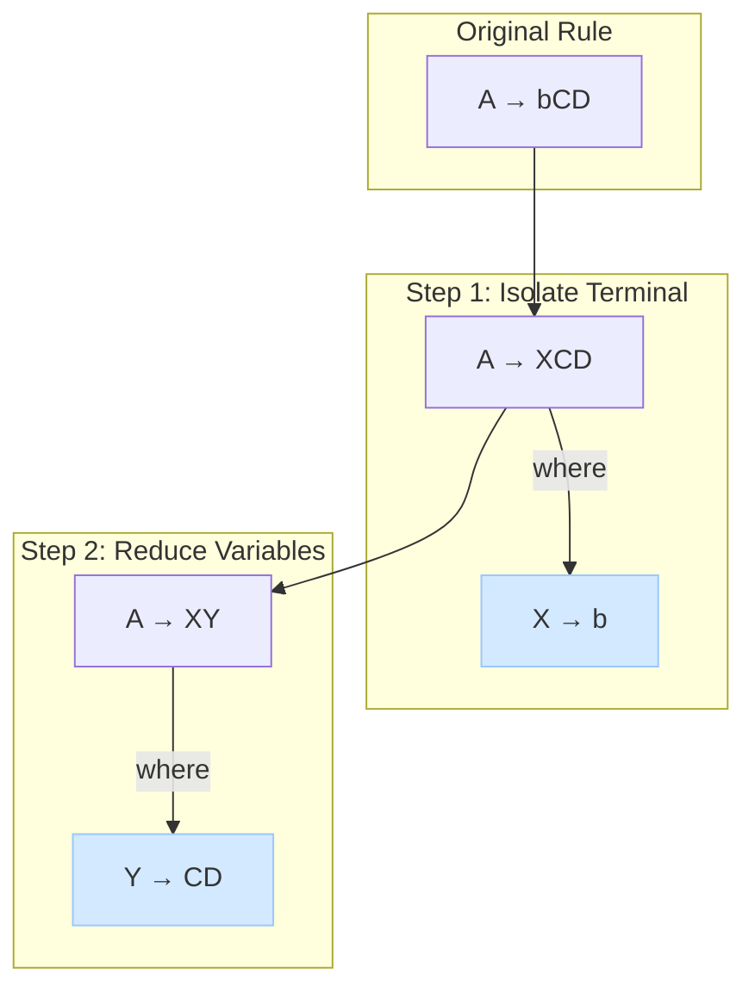

# Chomsky Normal Form (CNF)

Önceki bölümde `Context-Free Grammars` (CFG)'nin ne kadar güçlü olduğunu gördük. Ancak, kuralları `A → wBxyZ` gibi çok çeşitli ve karmaşık formlarda olabilir. Bu durum, gramerleri analiz eden ve onlarla çalışan algoritmaları (örneğin, bir string'in language'a ait olup olmadığını kontrol eden `CYK` algoritması) yazmayı zorlaştırır.

**Chomsky Normal Form (CNF)**, herhangi bir CFG'yi, kurallarını çok basit ve standart iki formattan birine indirgeyerek basitleştiren bir yöntemdir. Bu standardizasyon, birçok teorik ispatı ve pratik uygulamayı kolaylaştırır.

---

## 1. CNF'nin Tanımı

Bir Context-Free Grammar (CFG), **ε (boş string) üretmiyorsa** ve sahip olduğu tüm **productions (kurallar)** aşağıdaki iki formattan **yalnızca birine** uyuyorsa, **Chomsky Normal Form**'dadır denir:

1.  `A → BC`
    *   Bir variable, tam olarak **iki** başka variable'a dönüşür.

2.  `A → a`
    *   Bir variable, tam olarak **bir** terminal symbol'e dönüşür.

Burada `A`, `B`, `C` birer variable'dır ve `a` bir terminal'dir. Start symbol'ün `S → ε` şeklinde bir kurala sahip olmasına istisnai olarak izin verilebilir, ancak bu durumda `S` başka hiçbir kuralın sağ tarafında yer alamaz.

---

## 2. Neden Önemlidir?

CNF'nin getirdiği bu basit yapı, birçok avantaj sağlar:
*   **Algoritmik Kolaylık:** Belirli bir string'in bir language tarafından üretilip üretilemeyeceğini belirleyen `CYK (Cocke-Younger-Kasami)` gibi dinamik programlama tabanlı ayrıştırma (parsing) algoritmaları, gramerin CNF'de olmasını gerektirir.
*   **Teorik İspatlar:** Birçok teorem ve ispat, gramerin bu standart formda olduğu varsayılarak daha kolay yapılır.
*   **Parse Tree (Ayrıştırma Ağacı) Yapısı:** CNF'deki bir gramer için herhangi bir türetmenin parse tree'si her zaman bir **binary tree (ikili ağaç)** yapısındadır. Bu, ağacın derinliği ve string'in uzunluğu arasında bir ilişki kurmayı kolaylaştırır.

---

## 3. CFG'yi CNF'ye Dönüştürme

Herhangi bir CFG (ε üretmeyen), bir dizi adım takip edilerek eşdeğer bir CNF'ye dönüştürülebilir. Bu adımlar, gramerin kurallarını aşamalı olarak basitleştirir:

1.  **Yeni Bir Start Symbol Oluşturma:** Orijinal start symbol'ün başka kuralların sağ tarafında görünmesini engellemek için yeni bir start symbol `S₀` ve `S₀ → S` kuralı eklenir.
2.  **Unit Productions'ı Eleme (Eliminate Unit Productions):** `A → B` gibi bir variable'ın tek bir variable'a dönüştüğü kurallar kaldırılır.
3.  **Useless Symbols'ı Eleme (Eliminate Useless Symbols):** Hiçbir terminal string'i üretemeyen veya start symbol'den ulaşılamayan variable'lar ve ilgili kurallar kaldırılır.
4.  **Kuralları CNF Formatına Getirme:**
    *   Kuralların sağ tarafındaki terminal'ler, yeni variable'larla değiştirilir.
    *   İkiden fazla variable içeren kurallar, zincirleme şekilde ikili kurallara bölünür.

*Görsel: `A → bCD` gibi karmaşık bir kuralın CNF'ye dönüştürülmesi. Önce terminal (`b`) kendi değişkenine (`X`), sonra da kalan çoklu değişkenler (`CD`) ikili bir yapıya (`Y`) ayrılır.*

Bu adımların sonunda, orijinal gramerle aynı language'ı tanıyan ancak tüm kuralları CNF formatında olan yeni bir gramer elde edilir.

---

  
<b>Soru 1:</b> Aşağıdaki kurallardan hangisi `Chomsky Normal Form` (CNF) **formatına uygun değildir**?

  
A) `S → AB`

  
B) `A → a`

  
C) `B → aC`

  
D) `C → DE`

  

    
<b>Cevap: C.</b> CNF kuralları ya bir variable'ın iki variable'a (`A → BC`) ya da bir variable'ın bir terminal'e (`A → a`) dönüşmesi şeklindedir. `B → aC` kuralı, bir terminal ve bir variable'ı bir arada içerdiği için bu formata uymaz.

  

  
<b>Soru 2:</b> `Chomsky Normal Form`'un en önemli pratik faydalarından biri nedir?

  
A) Gramerin daha az kurala sahip olmasını sağlamak.

  
B) CYK gibi bazı standart ayrıştırma (parsing) algoritmalarının çalışabilmesi için bir ön koşul olması.

  
C) Gramerin ambiguous (belirsiz) olmasını engellemek.

  
D) Sadece regular languages (düzenli diller) tanımlayabilen gramerler oluşturmak.

  

    
<b>Cevap: B.</b> CNF, gramer kurallarını standartlaştırarak algoritmaların işini kolaylaştırır. Özellikle, bir string'in bir CFG tarafından üretilip üretilemeyeceğini verimli bir şekilde test eden CYK algoritması, gramerin CNF'de olmasını gerektirir.

  

  
<b>Soru 3:</b> CNF'ye dönüştürülmüş bir gramer tarafından üretilen bir string'in parse tree'si (ayrıştırma ağacı) her zaman hangi özelliğe sahiptir?

  
A) Derinliği en fazla 2'dir.

  
B) Tüm yaprakları variable'dır (variables).

  
C) Her iç düğümün tam olarak iki çocuğu vardır (binary tree yapısındadır).

  
D) Sadece bir tane yaprağı olabilir.

  

    
<b>Cevap: C.</b> CNF'deki `A → BC` kuralı, bir düğümün tam olarak iki variable çocuğa dallanmasını sağlar. `A → a` kuralı ise bir yaprak (terminal) oluşturur. Bu nedenle, ortaya çıkan ağacın tüm iç düğümleri (yapraklar hariç) tam olarak iki çocuğa sahip olur, bu da bir binary tree (ikili ağaç) tanımıdır.

  

