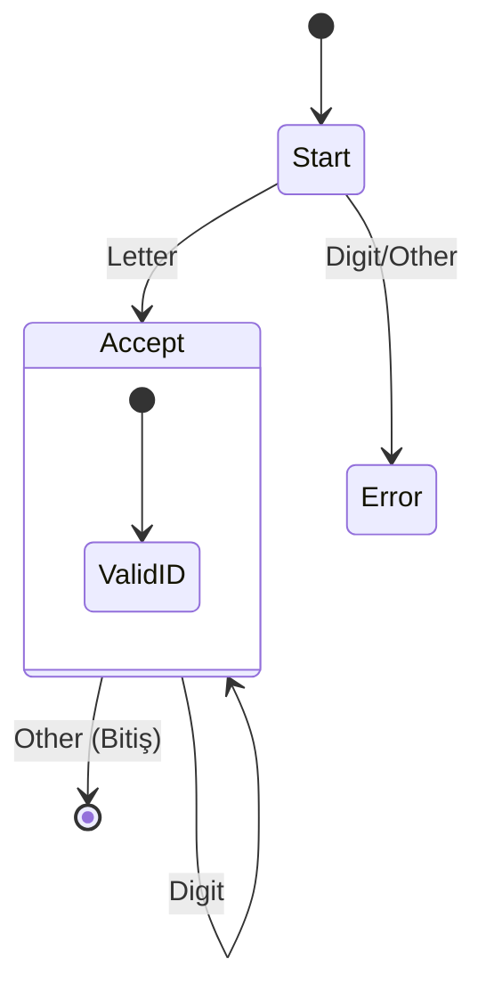
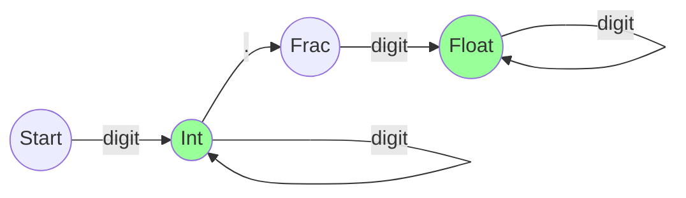

# Lexical Analysis (Sözcük Analizi)
{: .no_toc }

Kodun karakter yığınından anlamlı kelimelere (Token) dönüştürülmesi. Regular Expressions ve Finite Automata.

## İçindekiler
{: .no_toc .text-delta }

1. TOC
{:toc}

---

## 1. Lexer'ın Görevi

Derleyicinin ilk aşamasıdır.
*   **Girdi:** Kaynak kod (karakter dizisi). `sum = 3 + 2`
*   **Çıktı:** Token dizisi. `<id,sum> <assign> <int,3> <plus> <int,2>`
*   **Görevi:** Gereksiz boşlukları ve yorum satırlarını atar, kelimeleri gruplar.

---

## 2. Token, Lexeme, Pattern

Bu üç kavram sıkça karıştırılır:

| Terim | Tanım | Örnek |
|:---|:---|:---|
| **Pattern** | Bir token'ın uyması gereken kural (Regex). | `[0-9]+` |
| **Lexeme** | Kodun içinde eşleşen gerçek karakter grubu. | `123`, `count` |
| **Token** | Lexeme'in kategorisi (Derleyicinin kullandığı tür). | `INTEGER_LITERAL`, `IDENTIFIER` |

---

## 3. Regular Expressions (Düzenli İfadeler)

Token kalıplarını tanımlamak için kullanılır. Context-Free Grammar kadar güçlü değildir (iç içe parantezleri sayamaz) ama daha hızlıdır.

*   **Concat:** `ab` (a'dan sonra b)
*   **Union:** `a|b` (a veya b)
*   **Kleene Star:** `a*` (sıfır veya daha fazla a)

### Örnek Regexler
*   **Integer:** `[0-9]+`
*   **Identifier (Değişken):** `[a-zA-Z][a-zA-Z0-9]*` (Harfle başla, harf/sayı ile devam et).

---

## 4. Finite Automata (Sonlu Otomatlar)

Regex'in çalıştırılabilir makine halidir. Lexer aslında bir **DFA (Deterministic Finite Automaton)**'dır.

### Bir "Identifier" Tanıyan DFA Görseli

Kural: Harfle başla, sonrasında harf veya rakam gelebilir.

### Bir "Integer" veya "Float" Tanıyan DFA

`123` (Int) vs `123.45` (Float).

---

## 5. `lex` ve `yacc` Araçları

Bu otomatları elle yazmak zordur. Unix dünyasında standart araçlar kullanılır:
1.  **Lex (Flex):** `.l` dosyasını alır (Regexler), C kodu üretir (Lexer).
2.  **Yacc (Bison):** `.y` dosyasını alır (BNF Gramer), C kodu üretir (Parser).

---

## 6. Alıştırmalar (Self-Quiz)

<strong>Soru 1:</strong> Neden Syntax Analizi için Regex yerine Gramer (BNF) kullanılır?

 
Cevap: <strong>Hafıza Yetersizliği.</strong>
Regex bir "State Machine"dir ve sayma yeteneği yoktur (Finite Memory). "Açılan parantez kadar kapanan parantez olsun" kuralını Regex ile yazamazsınız. Bunun için Stack yapısı olan Gramer (Pushdown Automata) gerekir.

<strong>Soru 2:</strong> Lexer "Reserved Word" (örn: <code>while</code>) ile "Identifier" (örn: <code>whileXY</code>) ayrımını nasıl yapar?

 
Cevap: <strong>Öncelik Kuralı.</strong>
Genelde "En uzun eşleşme" (Longest Match) kuralı geçerlidir. Eğer eşitse, Lexer'a verilen kural sırasına bakılır. <code>while</code> bir keyword olarak daha önce tanımlanır.

