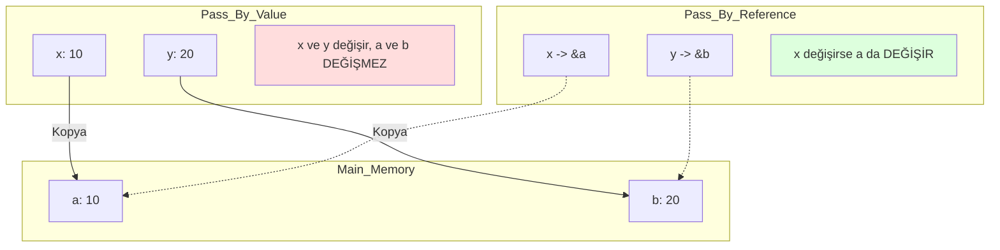

# Subprograms (Functions)
{: .no_toc }

Fonksiyonların anatomisi, parametre aktarım yöntemleri ve Stack Frame yapısı.

## İçindekiler
{: .no_toc .text-delta }

1. TOC
{:toc}

---

## 1. Subprogramın Temelleri

Bir alt programın 2 temel özelliği vardır:
1.  **Single Entry:** Tek bir giriş noktası vardır.
2.  **Caller Suspension:** Çağrılan fonksiyon çalışırken, çağıran (caller) durur.

---

## 2. Parameter Passing Modes

Fonksiyonlara veri nasıl gönderilir?

### A. Pass-by-Value (Değer ile)
*   **Mantık:** Değerin **kopyası** gönderilir.
*   **Diller:** C, Java (Primitifler), Python (Immutablelar).
*   **Avantaj:** Güvenli (Orijinal veri değişmez).
*   **Dezavantaj:** Büyük struct/array kopyalamak pahalıdır.

### B. Pass-by-Reference (Referans ile)
*   **Mantık:** Değişkenin **adresi** (erişim yolu) gönderilir. `alias` oluşturulur.
*   **Diller:** C++ (`&`), C (Pointer ile simüle edilir).
*   **Avantaj:** Hızlı (Kopyalama yok), veriyi değiştirebilir.
*   **Dezavantaj:** Yan etkiler (Side Effects) oluşabilir.

### C. Pass-by-Name (İsim ile)
*   **Mantık:** Parametre, çağrıldığı yerde **metin olarak yerine konulur** (Textual Substitution). Lazy Evaluation gibidir.
*   **Örnek:** Algol 60 (Jensen's Device). Modern dillerde pek yoktur (Macro'lar hariç).

### Görsel Karşılaştırma

`void swap(x, y) { temp=x; x=y; y=temp; }`



---

## 3. Implementing Subprograms (Stack Frame)

Bir fonksiyon çağrıldığında bellekte (Stack) neler olur? **Activation Record** (ARI) oluşturulur.

| Bölüm | İçerik |
|:---|:---|
| **Local Variables** | Fonksiyonun kendi değişkenleri. |
| **Parameters** | Caller'dan gelen argümanlar. |
| **Dynamic Link** | Çağıranın (Caller) Stack Frame'ine pointer. (Pop için). |
| **Static Link** | Kapsayan bloğa (Static Scope) pointer. (Global erişimi için). |
| **Return Address** | Fonksiyon bitince nereye dönülecek? |

---

## 4. Closures (Kapanışlar)

Fonksiyonel dillerde (ve modern JS/Python'da) bir fonksiyon, **tanımlandığı ortamdaki değişkenleri** beraberinde paketleyip taşıyabilir.

```javascript
function makeAdder(x) {
  return function(y) {
    return x + y; // x'i hatırlıyor!
  };
}
var add5 = makeAdder(5);
alert(add5(2)); // 7
```

---

## 5. Alıştırmalar (Self-Quiz)

<details>
<summary><strong>Soru 1:</strong> Java'da nesneler (Objects) metodlara nasıl geçer?</summary>
<br>
Cevap: <strong>Pass-by-Value (Reference Value).</strong>
Çok karıştırılır! Java'da her şey Value ile geçer. Ancak nesne değişkenleri aslında birer "Referans" (Pointer) tuttuğu için, siz "Referansın Kopyasını" gönderirsiniz.
Sonuç: Nesnenin içeriğini (field) değiştirebilirsiniz, ama nesnenin kendisini (pointer'ı) başka bir nesneye yönlendiremezsiniz.
</details>

<details>
<summary><strong>Soru 2:</strong> "Static Link" ne işe yarar?</summary>
<br>
Cevap: <strong>Nested (İç içe) fonksiyonlarda scope erişimi sağlar.</strong>
Eğer <code>sub()</code> fonksiyonu <code>main()</code> içinde tanımlıysa, <code>sub</code> içinden <code>main</code>'in değişkenlerine erişmek için Static Link (Static Chain) takip edilir.
</details>


