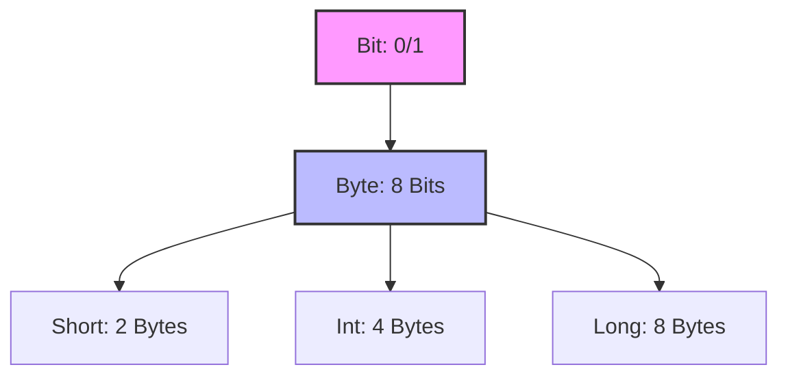
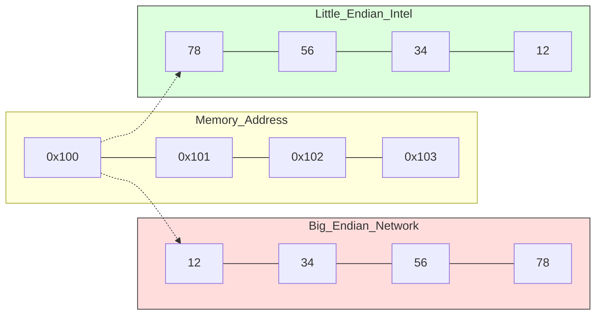
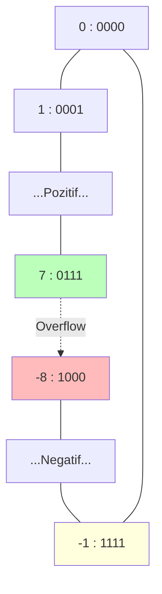

# Bits, Bytes, and Integers
{: .no_toc }

Bilgisayar sistemlerinin temel yapı taşı olan bitler, tamsayılar ve bunların hafızada nasıl saklandığına dair kapsamlı rehber.

## İçindekiler
{: .no_toc .text-delta }

1. TOC
{:toc}

---

## 1. Bits & Bytes: Neden Binary?

Bilgisayarlar analog değil, dijital cihazlardır. Voltajın varlığı (1) veya yokluğu (0) üzerine kuruludurlar.

*   **Bit:** En küçük veri birimi (0 veya 1).
*   **Byte:** 8 bitlik grup. Belleğin en küçük adreslenebilir birimidir.
    *   Değer Aralığı: $00000000_2$ ile $11111111_2$ arası.
    *   Decimal: $0$ ile $255$.
    *   Hex: $00$ ile $FF$.

### Veri Birimleri Hiyerarşisi



---

## 2. Hexadecimal Notasyon

Binary okumak zordur (`1011011101011011`?). Decimal'e çevirmek işlem gerektirir. Hexadecimal (16'lık taban), binary'nin "kısaltılmış" halidir.

*   **Kural:** Her 4 bit = 1 Hex Rakamı.
*   **Örnek:** `1011 0101` $\to$ `0xB 0x5` $\to$ `0xB5`.

| Dec | Bin | **Hex** | Dec | Bin | **Hex** |
|:---:|:---:|:---:|:---:|:---:|:---:|
| 0 | 0000 | **0** | 8 | 1000 | **8** |
| 1 | 0001 | **1** | 9 | 1001 | **9** |
| 2 | 0010 | **2** | 10 | 1010 | **A** |
| 3 | 0011 | **3** | 11 | 1011 | **B** |
| 4 | 0100 | **4** | 12 | 1100 | **C** |
| 5 | 0101 | **5** | 13 | 1101 | **D** |
| 6 | 0110 | **6** | 14 | 1110 | **E** |
| 7 | 0111 | **7** | 15 | 1111 | **F** |

{: .note }
> **Ezber İpucu:**
> A=10, F=15 (Tümü 1). C=12 (`1100`), D=13 (`1101`).

---

## 3. C Veri Tipleri ve Boyutları

32-bit ve 64-bit mimariler arasındaki en büyük fark `long` ve `pointer` boyutlarındadır.

| C Type | 32-bit Size | **64-bit Size** |
|:---|:---:|:---:|
| `char` | 1 | 1 |
| `short` | 2 | 2 |
| `int` | 4 | 4 |
| `long` | 4 | **8** |
| `char *` (Pointer) | 4 | **8** |
| `float` | 4 | 4 |
| `double` | 8 | 8 |

{: .warning }
> **Sınav Tuzağı:**
> Asla "Pointer her zaman 4 byte'tır" diye düşünmeyin. Modern x86-64 sistemlerde pointer 8 byte'tır.

---

## 4. Addressing & Byte Ordering (Endianness)

Çok byte'lı bir veriyi (örneğin 4-byte `int`) belleğe nasıl yerleştiririz?
Örnek Sayı: `0x12345678` (32-bit int)
Adres: `0x100`

### Big Endian vs Little Endian

*   **Big Endian:** En anlamlı byte (MSB - `12`) en düşük adrese gelir. (İnsan okumasına benzer: Soldan sağa).
    *   *Kullanım:* Ağ protokolleri (TCP/IP).
*   **Little Endian:** En az anlamlı byte (LSB - `78`) en düşük adrese gelir. (Sayıyı tersten yazar).
    *   *Kullanım:* Intel/AMD x86 makineler, iOS, Android, Windows.

#### Görselleştirme (Mermaid)



### Endianness Tespiti (C Kodu)

```c
#include <stdio.h>

int main() {
    int x = 1; // 0x00000001
    // İlk byte'a (en düşük adres) bak
    char *p = (char *)&x; 
    
    if (*p == 1) {
        printf("Little Endian (LSB başta)\n");
    } else {
        printf("Big Endian (MSB başta)\n");
    }
}
```

---

## 5. Bitwise Operasyonlar

Mantıksal (`&&`, `||`) ile Bitwise (`&`, `|`) operatörleri karıştırmayın!

| Operatör | İsim | Açıklama | Örnek (A=`0110`, B=`1100`) |
|:---:|:---|:---|:---|
| `&` | AND | İkisi de 1 ise 1. | `0100` (4) |
| `\|` | OR | Biri bile 1 ise 1. | `1110` (14) |
| `^` | XOR | Farklıysa 1, aynıysa 0. | `1010` (10) |
| `~` | NOT | Tersini al (Flip). | `~A` = `1001` |
| `<<` | Left Shift | Sola kaydır, sağdan 0 ekle. | `x << k` $\approx x \times 2^k$ |
| `>>` | Right Shift | Sağa kaydır. (Detay aşağıda) | `x >> k` $\approx x / 2^k$ |

### Logical vs Arithmetic Right Shift

*   **Logical (`>>`):** Sol taraftan **0** doldurur. (Unsigned sayılar için).
*   **Arithmetic (`>>`):** Sol taraftan **işaret biti (Sign Bit)** ile doldurur. (Signed sayılar için).

{: .highlight }
> **Örnek:**
> `1010...` (Negatif sayı)
> *   Logical Shift: `0101...` (Pozitif oldu!)
> *   Arithmetic Shift: `1101...` (Negatifliği korudu).

---

## 6. Signed Integers: Two's Complement

Bilgisayarlar negatif sayıları saklamak için **Two's Complement** (İkiye Tümleyen) yöntemini kullanır.
En soldaki bit (MSB) **işaret bitidir**.
*   `0` $\to$ Pozitif
*   `1` $\to$ Negatif

### Formül
Bir sayının negatifini bulmak için:
$$ -x = \sim x + 1 $$
(Bütün bitleri ters çevir ve 1 ekle).

### Sayı Çemberi (4-Bit Örneği)



### Kritik Değerler (32-bit)

| İsim | Değer | Hex |
|:---|:---|:---|
| **UMax** | $2^{32}-1$ | `0xFFFFFFFF` |
| **TMax** | $2^{31}-1$ | `0x7FFFFFFF` |
| **TMin** | $-2^{31}$ | `0x80000000` |
| **-1** | $-1$ | `0xFFFFFFFF` |

{: .warning }
> **TMin Anomalisi:**
> Two's complement sisteminde `-TMin` işlemi sonucunda yine `TMin` elde edilir. Çünkü pozitif tarafta `TMin`'in mutlak değerini karşılayacak bir sayı yoktur (`TMax`, `|TMin|`'den 1 eksiktir).

---

## 7. Sınavlara Hazırlık: Casting & Tuzaklar

Sınavlarda en çok puan kaybettiren konu **Signed vs Unsigned** karşılaştırmalarıdır.

### Kural: Implicit Casting
Eğer bir ifadede hem `signed` hem `unsigned` varsa, C derleyicisi **Signed olanı Unsigned'a çevirir** ve işlemi öyle yapar.

```c
int s = -1;
unsigned int u = 1;

if (s < u) {
    printf("Bunu Beklersin (-1 < 1)");
} else {
    printf("AMA BU OLUR! (-1 > 1)");
}
```
**Neden?**
`-1`'in bit karşılığı `0xFFFFFFFF`'dir. Bu `unsigned` olarak okunduğunda `UMax` (4 Milyar küsür) olur. Dolayısıyla `4 Milyar > 1`.

### Expansion (Genişletme)
Küçük türden büyük türe geçerken (short $\to$ int):
1.  **Unsigned:** Zero Extension (Başa 0 ekle).
2.  **Signed:** Sign Extension (İşaret bitini kopyala).
    *   `short x = -10;` (`11...10110`)
    *   `int y = x;` (`11111...10110`) $\to$ Değer korunur.

---

## 8. Alıştırmalar (Self-Quiz)

Kendinizi deneyin. Cevabı görmek için tıklayın.

<details>
<summary><strong>Soru 1:</strong> <code>0x80000000</code> sayısı signed int olarak kaçtır?</summary>
<br>
Cevap: <strong>TMin (-2^31)</strong>. En soldaki bit 1 olduğu için negatiftir ve geri kalanlar 0'dır.
</details>

<details>
<summary><strong>Soru 2:</strong> <code>int x = 0x1234;</code> Little Endian makinede bellekteki ilk byte nedir?</summary>
<br>
Cevap: <strong>0x34</strong>. Little Endian "Küçük uç (Least Significant Byte) başta" demektir.
</details>

<details>
<summary><strong>Soru 3:</strong> <code>x ^ (x - 1)</code> işlemi ne işe yarar?</summary>
<br>
Cevap: <strong>En sağdaki 1'i ve sonrasını maskeler.</strong>
Örnek: <code>10100</code> (20)
<code>x-1</code>: <code>10011</code>
<code>XOR</code>: <code>00111</code>
Daha yaygın kullanım: <code>x & (x-1)</code> en sağdaki 1 bitini <strong>siler</strong>.
</details>

<details>
<summary><strong>Soru 4:</strong> (32-bit) <code>(int) 2147483647 + 1</code> sonucu nedir?</summary>
<br>
Cevap: <strong>-2147483648 (TMin)</strong>. Pozitif taşma (Overflow) olur ve sayı en küçük negatif sayıya döner.
</details>

---
{: .note }
Bu notlar **CS:APP** (Bryant & O'Hallaron) kitabının 2. Bölümüne dayalıdır.
