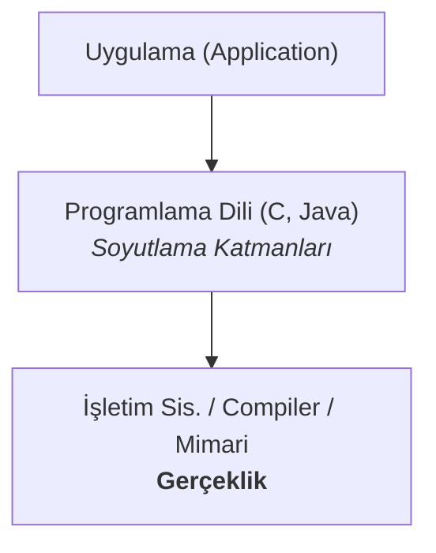
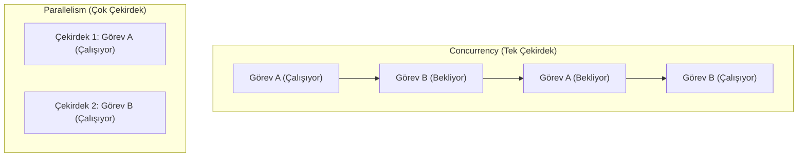

# Derse Giriş ve 5 Büyük Gerçek

Bu bölüm, dersin ana temasını ve bir sistem programcısı olarak her zaman aklınızda tutmanız gereken beş temel ilkeyi ("5 Büyük Gerçek") inceleyerek başlıyor.

---

## Dersin Teması: Soyutlama İyidir Ama Gerçekliği Unutma

Bilgisayar bilimi eğitimi büyük ölçüde **abstraction (soyutlama)** üzerine kuruludur. Soyut veri türleri, asimptotik analiz gibi kavramlar, karmaşık sistemleri daha yönetilebilir parçalara ayırmamıza yardımcı olur. Ancak bu soyutlamaların da sınırları vardır.

Bir programcı olarak, kodunuzun altındaki "gerçekliği" - donanımı, derleyiciyi ve işletim sistemini - anlamak sizi çok daha etkili kılacaktır. Bu ders, sizi bu gerçeklikle tanıştırmayı amaçlamaktadır. Bu yaklaşımın faydaları şunlardır:

*   **Daha Etkili Programlama:** Kodunuzun tam olarak ne yaptığını anlarsınız.
*   **Etkin Hata Ayıklama:** Özellikle zor, "gizemli" hataların kökenine inebilirsiniz.
*   **Performans Optimizasyonu:** Kodunuzun neden yavaş olduğunu anlayıp darboğazları ortadan kaldırarak performansını artırabilirsiniz.

  
<b>Soru:</b> Bir programcının, kodunun altında yatan donanım ve işletim sistemi gibi "gerçeklikleri" anlaması, ona en çok hangi konuda fayda sağlar?

  
A) Daha hızlı kod yazma.

  
B) Zor ve gizemli hataları ayıklama ve performansı optimize etme.

  
C) Daha fazla programlama dilini daha kolay öğrenme.

  
D) Kullanıcı arayüzünü daha iyi tasarlama.

  

    
<b>Cevap: B.</b> Soyutlamaların sızdığı veya performansın kritik olduğu durumlarda, altta yatan sistemin nasıl çalıştığını bilmek, bir programcının en güçlü silahıdır. Bu bilgi, özellikle zor hataları çözmede ve programı hızlandırmada fark yaratır.

  

---

## Büyük Gerçek #1: `int` Tamsayı Değildir, `float` Reel Sayı Değildir

Matematikte tamsayılar sonsuzdur, ancak bilgisayarlardaki `int` gibi veri türleri sınırlı sayıda bitle temsil edilir ve bu da **overflow (taşma)** gibi beklenmedik sonuçlara yol açabilir. Örneğin, 32-bit bir `int`, en fazla `2,147,483,647` değerini tutabilir. Bu değeri bir artırırsanız, sonuç `2,147,483,648` değil, negatif bir sayı (`-2,147,483,648`) olur.

Benzer şekilde, `float` ve `double` türleri reel sayıları temsil etmeye çalışır, ancak bunu sınırlı bir hassasiyetle yaparlar. Bu durum, küçük **rounding errors (yuvarlama hatalarının)** birikerek finansal veya bilimsel hesaplamalarda önemli sorunlara neden olmasına yol açabilir. Örneğin, `(3.14 + 1e20) - 1e20` işleminin sonucu `0.0` olabilirken, `3.14 + (1e20 - 1e20)` işleminin sonucu `3.14` olacaktır.

  
<b>Soru:</b> 32-bit işaretli bir tamsayı (`int`) değişkeninde `2,147,483,647` değeri varken, bu değişkene 1 eklenirse ne olur?

  
A) Değer `2,147,483,648` olur.

  
B) Program bir hata vererek çöker.

  
C) Değer, `integer overflow` nedeniyle negatif bir sayıya döner.

  
D) Değer değişmez, aynı kalır.

  

    
<b>Cevap: C.</b> Sınırlı bit sayısı nedeniyle, "overflow" (taşma) olur ve sayı doğrusunun en negatif ucuna döner. Bu, "Int'ler Tamsayı Değildir" gerçeğinin klasik bir örneğidir.

  

---

## Büyük Gerçek #2: Assembly Bilmek Zorundasınız

C, Java, Python gibi yüksek seviyeli diller programlamayı kolaylaştırsa da, derleyicinin bu dilleri makine koduna nasıl çevirdiğini anlamak çok önemlidir. Assembly, makine kodunun insan tarafından okunabilir halidir. Assembly anlamak şunları sağlar:
*   Derleyicinin kodunuzu nasıl optimize ettiğini (veya edemediğini) görmenizi.
*   Programınızın beklenmedik şekilde çökmesine neden olan düşük seviyeli hataları (örn. bellek bozulması) anlamanızı.
*   Kodunuzdaki performans darboğazlarını belirlemenizi.

  
<b>Soru:</b> Bir programcı, yazdığı C kodunun belirli bir bölümünün neden çok yavaş çalıştığını anlamak istiyor. Hangi araca veya bilgiye başvurması en aydınlatıcı olur?

  
A) Kodun asimptotik karmaşıklığını (`Big-O`) hesaplamak.

  
B) Derleyicinin ürettiği Assembly kodunu incelemek.

  
C) Daha yüksek seviyeli bir dil olan Python'da aynı kodu yazmak.

  
D) Programın kullandığı kütüphanelerin dokümantasyonunu okumak.

  

    
<b>Cevap: B.</b> Assembly kodunu incelemek, derleyicinin kodu nasıl optimize ettiğini, bellek erişimlerinin nasıl yapıldığını ve işlemcinin komutları nasıl yürüttüğünü en net şekilde gösterir. Bu, "Assembly Bilmek Zorundasınız" ve "Performans Asimptotik Karmaşıklıktan İbaret Değildir" gerçekleriyle doğrudan ilgilidir.

  

---

## Büyük Gerçek #3: Bellek Önemlidir (Memory Matters)

Bellek, sonsuz ve hatasız bir kaynak değildir. C ve C++ gibi diller bellek üzerinde tam kontrol sağlar, ancak bu büyük bir sorumluluktur.
*   **Bellek Hataları Tehlikelidir:** Bir dizinin sınırları dışına yazmak (`buffer overflow`) veya serbest bırakılmış bir bellek alanına erişmek (`dangling pointer`), programınızın çökmesine, öngörülemeyen davranışlara ve güvenlik açıklarına neden olabilir.
*   **Performans Bellek Hiyerarşisine Bağlıdır:** Modern bilgisayarlarda bellek erişimi, CPU hızından çok daha yavaştır. Bu yüzden **caches (önbellekler)** kullanılır. Veriye nasıl eriştiğiniz (örneğin, bir matrisin satırlarını veya sütunlarını dolaşmak), programınızın toplam çalışma süresini ve dolayısıyla performansını önemli ölçüde etkileyebilir.

  
<b>Soru:</b> Bir matris üzerinde işlem yapan iki farklı döngü yazılıyor. İkisi de aynı sayıda ve türde matematiksel işlem yapmasına rağmen, birisi diğerinden 10 kat daha hızlı çalışıyor. Bu durumun en olası açıklaması nedir?

  
A) Hızlı olan döngü daha az değişken kullanıyordur.

  
B) Yavaş olan döngüde bir `integer overflow` meydana geliyordur.

  
C) İşletim sistemi, hızlı olan döngüye daha fazla öncelik tanımıştır.

  
D) Hızlı olan döngü, bellek erişimlerini cache (önbellek) ile daha uyumlu yapıyordur.

  

    
<b>Cevap: D.</b> Modern sistemlerde işlemci hızı ile bellek hızı arasında büyük bir fark vardır. Belleğe sıralı ve öngörülebilir şekilde erişen kod, verileri cache'te (önbellek) tutarak işlemciyi daha az bekletir ve çok daha hızlı çalışır. Bu, "Bellek Önemlidir" gerçeğinin en somut örneklerinden biridir.

  

---

## Büyük Gerçek #4: Performans Asimptotik Karmaşıklıktan İbaret Değildir

Algoritma derslerinde, algoritmaları `O(N)` veya `O(N log N)` gibi notasyonlarla analiz ederiz. Bu, bir algoritmanın büyük veriler için nasıl ölçeklendiğini anlamak için mükemmeldir. Ancak pratikte, **sabit çarpanlar (constant factors)** da bir o kadar önemlidir.

Aynı asimptotik karmaşıklığa sahip iki kod parçası, çalışma hızı açısından 10 kat, hatta 100 kat farklılık gösterebilir. Performansı etkileyen faktörler arasında derleyici optimizasyonları, bellek erişim desenleri ve döngü yapıları bulunur.

### Amdahl Yasası
Amdahl Yasası, bir sistemin bir parçasını hızlandırdığımızda, toplam sistem performansında ne kadar iyileşme bekleyebileceğimizi söyleyen bir formüldür.

**Formül:** `S_toplam = 1 / ((1 - α) + (α / k))`
*   `S_toplam`: Toplam hızlanma.
*   `α`: Programın hızlandırılan kısmının toplam çalışma süresine oranı.
*   `k`: Programın o kısmındaki hızlanma faktörü.

**Örnek:** Bir programın %80'i (`α = 0.8`), 4 kat (`k = 4`) hızlandırılabiliyor.
`S_toplam = 1 / ((1 - 0.8) + (0.8 / 4)) = 1 / (0.2 + 0.2) = 1 / 0.4 = 2.5`
Yani, programın çok büyük bir kısmını 4 kat hızlandırsak bile, toplamda sadece 2.5 kat hızlanma elde ederiz. Bu, sistemin hızlandırılamayan kısmının (`%20`) genel performansta bir darboğaz oluşturduğunu gösterir.

  
<b>Soru:</b> Biri `200*N`, diğeri `2*N` maliyetli iki algoritma düşünün. Asimptotik analiz (`Big-O`) açısından her ikisi de `O(N)` olarak sınıflandırılır. Bu durum, pratik performans hakkında bize neyi hatırlatmalıdır?

  
A) Asimptotik analiz her zaman yanıltıcıdır.

  
B) Asimptotik analiz sabit çarpanları göz ardı eder, ancak bu çarpanlar gerçek dünyadaki performansı önemli ölçüde etkileyebilir.

  
C) `2*N` maliyetli algoritma her zaman daha iyi bir tasarıma sahiptir.

  
D) Her iki algoritma da pratikte tamamen aynı hızda çalışacaktır.

  

    
<b>Cevap: B.</b> `Big-O` notasyonu, bir algoritmanın büyüme oranını anlamak için kullanılır ve sabit çarpanları (`200` ve `2` gibi) ihmal eder. Ancak gerçek çalışma zamanı için bu çarpanlar kritiktir ve bir algoritmanın diğerinden 100 kat daha yavaş olmasına neden olabilir.

  

---

## Büyük Gerçek #5: Bilgisayarlar Program Çalıştırmaktan Fazlasını Yapar

Yazdığımız programlar tek başına çalışmazlar. Bir işletim sistemi üzerinde çalışırlar ve sürekli olarak dış dünya ile etkileşime girerler. **I/O (Girdi/Çıktı)** işlemleri, **Ağ (Networking)** iletişimi ve **Eşzamanlılık (Concurrency)** gibi faktörler, program performansını ve doğruluğunu derinden etkiler.

### Concurrency (Eşzamanlılık) vs. Parallelism (Paralellik)
Bu iki kavram sıkça karıştırılır, ancak aralarında önemli bir fark vardır:
*   **Concurrency:** Birden fazla görevin aynı anda **ilerlemesidir**. Tek bir işlemci çekirdeği, görevler arasında hızla geçiş yaparak bunu sağlayabilir (örneğin, bir görev I/O beklerken diğerini çalıştırmak).
*   **Parallelism:** Birden fazla görevin aynı anda **yürütülmesidir**. Bu, görevlerin farklı işlemci çekirdeklerine dağıtılmasıyla, yani gerçek donanım desteğiyle mümkün olur.

Bu etkileşimleri anlamak, sağlam ve verimli sistemler oluşturmanın temelidir.

  
<b>Soru:</b> Bir web sunucusu, tek bir işlemci çekirdeği üzerinde yüzlerce ağ bağlantısını aynı anda yönetebilmektedir. Bir bağlantıdan veri beklerken, diğer bağlantıdan gelen isteği işleyebilmektedir. Bu durum en iyi hangi kavramla açıklanır?

  
A) Concurrency (Eşzamanlılık)

  
B) Parallelism (Paralellik)

  
C) Amdahl Yasası

  
D) Bellek Hiyerarşisi

  

    
<b>Cevap: A.</b> Tek bir çekirdek, görevler arasında hızla geçiş yaparak (context switching) birden fazla işi aynı anda "ilerletiyormuş" gibi gösterebilir. Bu, paralellik değil, eşzamanlılıktır. Paralellik için görevlerin aynı anda, farklı çekirdeklerde fiziksel olarak çalıştırılması gerekir.

  

