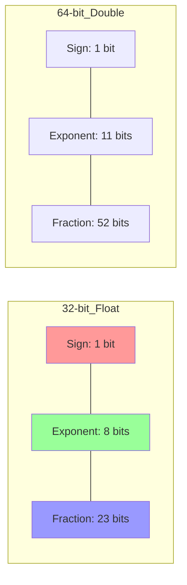

# Floating Point (IEEE 754)
{: .no_toc }

Reel sayıların bilgisayarda nasıl temsil edildiği, yuvarlama kuralları ve hassasiyet tuzakları.

## İçindekiler
{: .no_toc .text-delta }

1. TOC
{:toc}

---

## 1. Kesirli Sayıların Binary Gösterimi

Tıpkı ondalık sayılarda ($10^{-1}, 10^{-2}$) olduğu gibi, ikilik tabanda nokta sağı $2^{-k}$ ağırlığıyla ilerler.

*   **Formül:** $\sum_{k=-j}^i b_k \times 2^k$
*   **Örnek:** $101.11_2$
    *   $1 \times 4 + 0 \times 2 + 1 \times 1 + 1 \times (1/2) + 1 \times (1/4)$
    *   $4 + 1 + 0.5 + 0.25 = 5.75$

{: .warning }
> **Sonsuz Döngü:**
> $0.1$ (1/10) gibi sayılar binary'de **sonsuz devirlidir** (`0.000110011...`). Bu yüzden `0.1 + 0.2 == 0.3` karşılaştırması bilgisayarda genellikle **YANLIŞTIR** (False döner).

---

## 2. IEEE 754 Formatı

Reel sayılar şu formülle saklanır: $$ V = (-1)^s \times M \times 2^E $$

*   **s (Sign):** İşaret biti (0: Pozitif, 1: Negatif).
*   **M (Mantissa/Frac):** Kesirli kısım.
*   **E (Exponent):** Üs değeri.

### Bit Dağılımı (Görsel)



### Bias Değeri
Exponent alanı işaretsiz (unsigned) tutulur, ancak negatif üsleri de temsil edebilmek için bir **Bias** değeri çıkarılır.
*   **E = Exp - Bias**
*   Float Bias: $127$
*   Double Bias: $1023$

---

## 3. Sayı Kategorileri

Exp bitlerinin durumuna göre sayı 3 kategoriye ayrılır:

### A. Normalized Values (Olağan Durum)
*   **Koşul:** `Exp != 0` ve `Exp != Hepsi 1`.
*   **Mantissa:** $1.frac$ (Gizli 1 kuralı - Implicit Leading 1).
    *   Bitlerden tasarruf sağlar. `Frac` alanındaki 23 bit, aslında 24 bitlik hassasiyet sunar.

### B. Denormalized Values (Sıfıra Çok Yakın)
*   **Koşul:** `Exp == 0`.
*   **Mantissa:** $0.frac$ (Gizli 1 yok).
*   **Amaç:** 
    1.  **Sıfırı Temsil Etmek:** +0.0 ve -0.0.
    2.  **Gradual Underflow:** Sayıların aniden sıfır olması yerine yavaşça küçülmesini sağlar.

### C. Special Values (Özel Durumlar)
*   **Koşul:** `Exp == Hepsi 1` (255).
*   **Infinity ($\infty$):** `Frac == 0` ise. (Örn: `1.0 / 0.0`).
*   **NaN (Not a Number):** `Frac != 0` ise. (Örn: `sqrt(-1)`, `inf - inf`).

---

## 4. Rounding (Yuvarlama)

Varsayılan mod: **Round-to-Even** (En yakın çifte yuvarlama).
Amaç, sürekli yukarı yuvarlamanın yaratacağı istatistiksel sapmayı (bias) engellemektir.

**Kural:**
1.  Tam ortada değilse $\to$ En yakına.
2.  Tam ortadaysa (X.5) $\to$ Çift olana git.

| Sayı | Sonuç | Açıklama |
|:---:|:---:|:---|
| $1.4$ | $1$ | 1'e yakın. |
| $1.6$ | $2$ | 2'ye yakın. |
| $1.5$ | $2$ | Ortada. 2 Çift $\to$ Yukarı. |
| $2.5$ | $2$ | Ortada. 2 Çift $\to$ Aşağı! |
| $3.5$ | $4$ | Ortada. 4 Çift $\to$ Yukarı. |

---

## 5. Casting (Dönüşüm Kuralları)

C dilinde tipler arası dönüşüm yaparken nelere dikkat etmelisiniz?

*   **int $\to$ float:** Yuvarlama olabilir! (`int` 32 bit, `float` mantissa 23 bit. Hassasiyet yetmez).
*   **int/float $\to$ double:** Kayıp yok. (`double` mantissa 52 bit, `int`'i yutar).
*   **double $\to$ float:** Taşma (Overflow $\to$ Inf) veya Yuvarlama olabilir.
*   **float/double $\to$ int:** Kesir atılır (Truncation / Round-to-Zero).

{: .highlight }
> **Exam Tip (Sınav İpucu):**
> ```c
> int x = ...;
> float f = (float) x;
> double d = (double) x;
> ```
> *   `x == (int)(float) x` $\to$ **FALSE** (Büyük sayılarda x bozulur).
> *   `x == (int)(double) x` $\to$ **TRUE**.
> *   `d == (double)(float) d` $\to$ **FALSE** (Double float'a sığmaz).

---

## 6. Alıştırmalar (Self-Quiz)

<details>
<summary><strong>Soru 1:</strong> <code>123456789</code> sayısını <code>float</code>'a cast edip geri <code>int</code>'e çevirirsek sonuç aynı kalır mı?</summary>
<br>
Cevap: <strong>HAYIR.</strong> Sayı 2^26'dan büyüktür. Float'un mantissa kısmı (23 bit) bu kadar hassasiyeti tutamaz. Alt basamaklar yuvarlanır ve sayı değişir.
</details>

<details>
<summary><strong>Soru 2:</strong> <code>(3.14 + 1e20) - 1e20</code> işleminin sonucu nedir?</summary>
<br>
Cevap: <strong>0.0</strong>. Floating point toplama işleminde <strong>Associativity (Birleşme) yoktur</strong>. 1e20 çok büyük olduğu için 3.14 onun yanında kaybolur (yutulur). Sonuç 1e20 olur. Sonra 1e20 çıkarınca 0 kalır.
Doğrusu: <code>3.14 + (1e20 - 1e20)</code>.
</details>

<details>
<summary><strong>Soru 3:</strong> Round-to-even kuralına göre <code>10.5</code> kaça yuvarlanır?</summary>
<br>
Cevap: <strong>10</strong>. 10 çifttir, 11 tektir. Çift olana yuvarlar.
</details>
