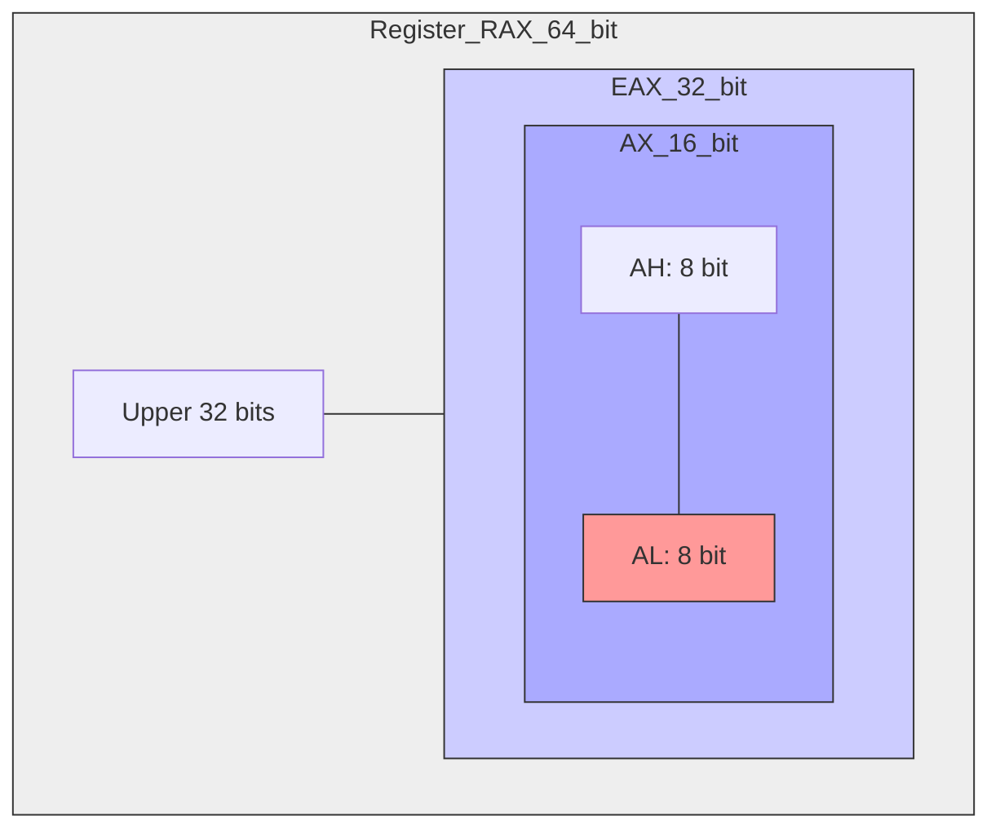

# Machine-Level Programming: Basics
{: .no_toc }

x86-64 mimarisinin temelleri: Registerlar, Operands ve Hafıza Erişimi.

## İçindekiler
{: .no_toc .text-delta }

1. TOC
{:toc}

---

## 1. Mimarinin Görünümü

Bir C programcısı için soyut olan donanım, Assembly programcısı için görünür hale gelir.

*   **Program Counter (%rip):** Bir sonraki çalışacak komutun adresi.
*   **Register File:** İşlemcinin "çalışma masası". Çok hızlı erişilen 16 adet değişken.
*   **Condition Codes:** Son işlemin durumu (Negatif mi? Sıfır mı? Taşma var mı?).
*   **Memory:** Byte dizisi olarak görülen devasa saklama alanı.

---

## 2. x86-64 Register Hiyerarşisi

64-bitlik bir register'ın (`%rax`) alt parçalarına farklı isimlerle erişilebilir. Bu, geriye dönük uyumluluk (backward compatibility) içindir.

### Görsel Yapı (Mermaid)

### Önemli Kural: 32-bit Yazma
{: .warning }
> **Zero Extension Kuralı:**
> Eğer bir register'ın 32-bitlik kısmına (`%eax`) yazarsanız, üstteki 32-bit **OTOMATİK OLARAK SIFIRLANIR**.
> *   `movl $1, %eax` $\to$ `%rax` tamamen `0x0000000000000001` olur.
> *   `movb`, `movw` komutlarında bu temizleme **YOKTUR**.

### Register Görevleri

| Register | 32-bit | Görev / Rol |
|:---|:---|:---|
| `%rax` | `%eax` | **Return Value** (Dönüş Değeri) |
| `%rdi` | `%edi` | **1. Argüman** |
| `%rsi` | `%esi` | **2. Argüman** |
| `%rdx` | `%edx` | **3. Argüman** |
| `%rcx` | `%ecx` | **4. Argüman** |
| `%r8` - `%r9` | ... | 5. ve 6. Argümanlar |
| `%rsp` | `%esp` | **Stack Pointer** (Sakın elleme!) |
| `%rbp` | `%ebp` | Base Pointer / Callee Saved |

---

## 3. Operand Tipleri

Bir assembly komutu veriyi nereden alabilir?

1.  **Immediate ($):** Sabit sayı.
    *   `$0x1F`, `$-5`. (Dolar işareti şart!)
2.  **Register (%):** Register içindeki değer.
    *   `%rax`, `%r13`.
3.  **Memory (parantez):** O adresteki değer. Pointer dereferencing gibidir `*ptr`.
    *   `(%rax)` $\to$ `%rax` içindeki adrese git, veriyi al.

---

## 4. Memory Addressing Modes

En güçlü ve en karmaşık kısım burasıdır. Dizi ve pointer aritmetiği burada yapılır.

**Genel Formül:**
$$ D(R_b, R_i, S) \to Mem[Reg[R_b] + Reg[R_i] \times S + D] $$

*   **D:** Displacement (Sabit sayı).
*   **Rb:** Base Register (Başlangıç adresi).
*   **Ri:** Index Register (Döngü değişkeni gibi).
*   **S:** Scale (1, 2, 4, 8). (Veri tipi boyutu).

### Örnek Tablosu
Varsayalım: `%rdx = 0xF000`, `%rcx = 0x0100`

| İfade | Hesaplama | Adres Sonucu | Anlamı |
|:---|:---|:---|:---|
| `0x8(%rdx)` | $0xF000 + 8$ | `0xF008` | `p->field` (Struct) |
| `(%rdx, %rcx)` | $0xF000 + 0x0100$ | `0xF100` | `A[i]` (Byte dizisi) |
| `(%rdx, %rcx, 4)` | $0xF000 + 0x0100 \times 4$ | `0xF400` | `int A[i]` |
| `0x80(,%rdx,2)` | $0xF000 \times 2 + 0x80$ | `0x1E080` | Karmaşık aritmetik |

---

## 5. Data Movement (MOV)

`movq Source, Dest`

{: .note }
> **Altın Kural:**
> İki operand AYNI ANDA **Memory** olamaz.
> *   Yanlış: `movq (%rax), (%rbx)`
> *   Doğru: `movq (%rax), %r8` sonra `movq %r8, (%rbx)`

---

## 6. Alıştırmalar (Self-Quiz)

<strong>Soru 1:</strong> <code>movl $-1, %eax</code> komutu sonrası <code>%rax</code> registerının değeri hex olarak nedir?

 
Cevap: <strong>0x00000000FFFFFFFF</strong>.
Yanlış cevap: <code>0xFFFFFFFFFFFFFFFF</code>.
Neden? Çünkü <code>movl</code> (32-bit move) hedef registerın üst 32 bitini <strong>sıfırlar</strong>. Eğer <code>movq $-1, %rax</code> olsaydı hepsi F olurdu.

<strong>Soru 2:</strong> <code>%rdx=0x100</code>, <code>%rcx=2</code> ise <code>0x10(%rdx, %rcx, 8)</code> adresi kaçtır?

 
Cevap: <strong>0x120</strong>.
Hesap: <code>0x100 + (2 * 8) + 0x10</code>
<code>0x100 + 0x10 + 0x10</code> = <code>0x120</code>.

<strong>Soru 3:</strong> <code>(%rax)</code> ile <code>%rax</code> arasındaki fark nedir?

 
Cevap: <code>%rax</code> registerın içindeki <strong>değerdir</strong> (örneğin bir adres).
<code>(%rax)</code> ise o <strong>adreste saklanan veridir</strong> (Memory Access / Dereference). C dilindeki <code>p</code> vs <code>*p</code> farkı gibidir.

