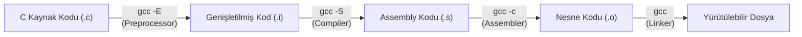
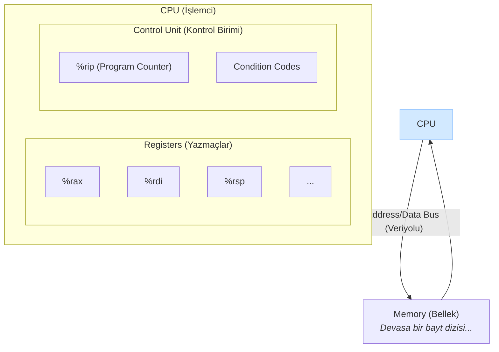

# Makine Kodu Temelleri: C'den Assembly'ye

Yazdığımız C kodu, işlemci tarafından doğrudan anlaşılamaz. Bir **compiler (derleyici)**, bu insan tarafından okunabilir kodu, işlemcinin yürütebileceği düşük seviyeli **machine instructions (makine komutlarına)** dönüştürür. Bu komutların insan tarafından okunabilir gösterimine **Assembly dili** denir. Bu bölümde, bu dönüşüm sürecini ve Assembly dilinin temellerini inceleyeceğiz.

---

## 1. Derleme Süreci: Koddan Yürütülebilir Dosyaya

Bir C programını derlediğimizde aslında birkaç adımlık bir süreç işler:

1.  **C Kodu (`program.c`):** Yazdığımız kaynak kod.
2.  **Compiler:** Kaynak kodu Assembly diline çevirir.
3.  **Assembler:** Assembly kodunu, makine tarafından okunabilen ikili **object code (nesne koduna)** dönüştürür.
4.  **Linker:** Nesne kodunu, `printf` gibi kütüphane fonksiyonlarıyla birleştirerek son **executable (yürütülebilir dosyayı)** oluşturur.

### Derleme Aşamalarını `gcc` ile Gözlemlemek

`gcc` derleyicisi, bu sürecin her bir adımında durup ara dosyaları incelememize olanak tanır:

1.  **Preprocessor (Önişlemci): `-E`**
    *   `#include` direktiflerini ve `#define` makrolarını koda dahil eder.
    *   `gcc -E program.c > program.i` komutuyla sadece bu adımı çalıştırıp, genişletilmiş kaynak kodunu (`.i` dosyası) görebilirsiniz.
2.  **Compiler (Derleyici): `-S`**
    *   Önişlemciden geçen kodu Assembly diline çevirir.
    *   `gcc -S program.c` komutu, `program.s` adında bir Assembly dosyası oluşturur.
3.  **Assembler (Birleştirici): `-c`**
    *   Assembly kodunu makine diline (nesne koduna) çevirir.
    *   `gcc -c program.c` komutu, `program.o` adında bir nesne dosyası oluşturur.
4.  **Linker (Bağlayıcı):** (Varsayılan)
    *   `gcc program.o -o program` komutu, nesne dosyasını gerekli kütüphanelerle birleştirerek `program` adında yürütülebilir bir dosya oluşturur.



<div class="quiz-question">
  <p><b>Soru:</b> `gcc -c program.c` komutu çalıştırıldığında hangi dosya üretilir?</p>
  <div class="quiz-option">A) `program.s` (Assembly kodu)</div>
  <div class="quiz-option" data-correct="true">B) `program.o` (Nesne kodu)</div>
  <div class="quiz-option">C) `program.i` (Önişlemciden geçmiş kod)</div>
  <div class="quiz-option">D) `program` (Yürütülebilir dosya)</div>
  <div class="quiz-explanation">
    <p><b>Cevap: B.</b> `-c` parametresi, `gcc`'ye derleme sürecini Assembly adımı tamamlandıktan sonra durdurmasını ve linkleme yapmadan, makine diline çevrilmiş olan nesne kodunu (`.o` dosyası) üretmesini söyler.</p>
  </div>
</div>

<div class="quiz-question">
  <p><b>Soru:</b> Bir C programını derlerken, Assembly kodunu (`.s` dosyası) görmek için `gcc`'ye hangi parametre verilir?</p>
  <div class="quiz-option">A) `-c`</div>
  <div class="quiz-option">B) `-o`</div>
  <div class="quiz-option" data-correct="true">C) `-S`</div>
  <div class="quiz-option">D) `-E`</div>
  <div class="quiz-explanation">
    <p><b>Cevap: C.</b> `gcc -S program.c` komutu, derleme işlemini Assembly kodu ürettikten sonra durdurur ve `program.s` adlı bir dosya oluşturur.</p>
  </div>
</div>

---

## 2. Assembly Programcısının Gözünden Donanım Mimarisi

Assembly seviyesinde programlama yaparken, C’deki değişkenler veya fonksiyonlar gibi soyut kavramlar yerine, işlemcinin doğrudan yönettiği fiziksel kaynakları görürüz. Bu kaynaklar, bir programın durumunu (state) tanımlar.



*   **Program Counter (PC / `%rip`):** İşlemcinin o an yürüttüğü komuttan bir sonraki komutun bellek adresini tutan en önemli register’dır.
*   **Registers (Yazmaçlar):** İşlemcinin içindeki, çok hızlı erişilebilen küçük depolama birimleridir. Lokal değişkenler ve ara hesaplama sonuçları gibi sık kullanılan veriler burada tutulur.
*   **Condition Codes (Durum Kodları):** En son yapılan aritmetik veya mantıksal işlemin sonucu hakkında bilgi tutan (örneğin, sonuç sıfır mıydı, negatif miydi vb.) tek bitlik bayraklardır. `if` ve `while` gibi yapıların temelini oluştururlar.
*   **Memory (Bellek):** Kodun kendisi, global değişkenler, yığın (stack) ve programın çalışma zamanında ayırdığı diğer verilerin (heap) tutulduğu devasa bir bayt dizisidir.

<div class="quiz-question">
  <p><b>Soru:</b> C dilindeki `if (x > y)` gibi koşullu ifadelerin çalışmasını sağlayan temel donanım mekanizması nedir?</p>
  <div class="quiz-option">A) Program Counter (`%rip`)</div>
  <div class="quiz-option">B) Registers (Yazmaçlar)</div>
  <div class="quiz-option" data-correct="true">C) Condition Codes (Durum Kodları)</div>
  <div class="quiz-option">D) Bellek Adresleri</div>
  <div class="quiz-explanation">
    <p><b>Cevap: C.</b> `cmp` gibi karşılaştırma komutları, sonucun (büyük, küçük, eşit vb.) ne olduğuna dair bilgiyi Durum Kodları'na (Condition Codes) yazar. `jg` (jump if greater) gibi koşullu dallanma komutları da bu kodları okuyarak programın akışını yönlendirir ve `if-else` mantığını oluşturur.</p>
  </div>
</div>

---

## 3. x86-64 Mimarisi ve Register'lar

Günümüzdeki çoğu işlemci **x86-64** mimarisini kullanır ve 16 adet genel amaçlı 64-bit'lik register sunar. Bu register'ların bazıları, fonksiyon çağrıları sırasında belirli roller üstlenir:

| Register Adı | Tipik Kullanım Amacı |
| :--- | :--- |
| `%rax` | Fonksiyon dönüş değeri |
| `%rdi`, `%rsi`, `%rdx`, `%rcx`, `%r8`, `%r9` | Fonksiyon argümanları (ilk altı) |
| `%rsp` | Stack (Yığın) işaretçisi |

<div class="quiz-question">
  <p><b>Soru:</b> x86-64 mimarisinde, bir fonksiyondan dönen tamsayı veya pointer değeri tipik olarak hangi register'da bulunur?</p>
  <div class="quiz-option" data-correct="true">A) `%rax`</div>
  <div class="quiz-option">B) `%rsp`</div>
  <div class="quiz-option">C) `%rdi`</div>
  <div class="quiz-option">D) `%rbp`</div>
  <div class="quiz-explanation">
    <p><b>Cevap: A.</b> Çağrı kurallarına göre, fonksiyonun dönüş değeri `%rax` register'ına yerleştirilerek çağıran fonksiyona döndürülür.</p>
  </div>
</div>

---

## 4. Temel Komut: `mov` (Veri Taşıma)

Assembly'deki en temel komutlardan biri `mov`'dur. Bir değeri bir yerden başka bir yere kopyalar. Komut, veri boyutunu belirten bir sonek alır: `movb` (1 byte), `movl` (4 byte), `movq` (8 byte).

**`movq Source, Destination`**

*   **Source (Kaynak):**
    *   **Immediate (Sabit):** `$0x100` gibi dolar işaretiyle başlayan sabit bir değer.
    *   **Register:** `%rax` gibi bir register.
    *   **Memory (Bellek):** `(%rax)` gibi parantez içinde bir adres.
*   **Destination (Hedef):**
    *   **Register:** `%rbx` gibi bir register.
    *   **Memory (Bellek):** `(%rbx)` gibi bir adres.

**Kısıtlama:** Tek bir `mov` komutuyla bellekten belleğe doğrudan veri kopyalamak mümkün değildir. Veri önce bir register'a alınmalı, sonra o register'dan hedefe yazılmalıdır.

<div class="quiz-question">
  <p><b>Soru:</b> `movq` komutunun en temel kısıtlaması aşağıdakilerden hangisidir?</p>
  <div class="quiz-option">A) Sadece 64-bit verileri taşıyabilir.</div>
  <div class="quiz-option">B) Bir register'daki veriyi başka bir register'a kopyalayamaz.</div>
  <div class="quiz-option" data-correct="true">C) Bir bellek adresindeki veriyi doğrudan başka bir bellek adresine kopyalayamaz.</div>
  <div class="quiz-option">D) Sabit bir değeri (`immediate`) bir bellek adresine yazamaz.</div>
  <div class="quiz-explanation">
    <p><b>Cevap: C.</b> x86-64 mimarisinde, bellekten belleğe doğrudan bir taşıma işlemi yoktur. Bu işlem her zaman bir ara register kullanılarak iki adımda yapılır: önce bellekten register'a, sonra register'dan belleğe.</p>
  </div>
</div>

---

## 5. Temel Aritmetik ve Kontrol Akışı Komutları

Bir programı dinamik hale getiren temel yapı taşları aritmetik işlemler ve `if/else` gibi kontrol akışlarıdır.

### a) Aritmetik Komutlar: `addq`, `subq`

*   `addq S, D`: `D = D + S` (Toplama)
*   `subq S, D`: `D = D - S` (Çıkarma)

**Örnek: `a = b + c` C kodunun Assembly Karşılığı**
`b`'nin `%rdi`'de, `c`'nin `%rsi`'de tutulduğunu ve sonucun (`a`) `%rax`'e yazılacağını varsayalım.

**C Kodu:**
```c
long a = b + c;
```

**Assembly Karşılığı:**
```asm
movq %rdi, %rax   # a = b; (%rax = %rdi)
addq %rsi, %rax   # a = a + c; (%rax = %rax + %rsi)
```
Önce `b`'nin değeri `%rax`'e kopyalanır, ardından `c`'nin değeri `%rax`'e eklenir. Sonuç `%rax`'te kalır.

### b) Kontrol Akışı: `cmpq` ve `je`

*   `cmpq S2, S1`: Arka planda `S1 - S2` işlemini yapar ve sonucu kaydetmez, sadece **durum kodlarını (condition codes)** ayarlar.
*   `je etiket`: Eğer `cmpq`'nun sonucu sıfır ise (yani `S1 == S2`), programın akışını belirtilen `etiket`'e zıplatır.

Bu iki komut, `if (a == b)` gibi yapıların temelini oluşturur.

<div class="quiz-question">
  <p><b>Soru:</b> Bir `sum` fonksiyonu, kendisine argüman olarak gelen register'lar dışında `%rbx` register'ını da bir ara hesaplama için kullanmak istiyor. Fonksiyon çağrı kurallarına göre `sum` fonksiyonu ne yapmalıdır?</p>
  <div class="quiz-option">A) Hiçbir şey yapmasına gerek yok, `%rbx`'i doğrudan kullanabilir.</div>
  <div class="quiz-option" data-correct="true">B) `%rbx` "callee-saved" olduğu için, fonksiyonun başında orijinal değerini yığına kaydetmeli ve fonksiyondan çıkmadan önce geri yüklemelidir.</div>
  <div class="quiz-option">C) `%rbx` "caller-saved" olduğu için, çağıran fonksiyonun sorumluluğundadır. `sum` fonksiyonu bir şey yapmaz.</div>
  <div class="quiz-option">D) `%rbx` register'ı sadece işletim sistemi tarafından kullanılabilir.</div>
  <div class="quiz-explanation">
    <p><b>Cevap: B.</b> `%rbx`, `%rbp`, ve `%r12-%r15` register'ları "callee-saved" (çağrılan tarafından korunur) olarak kabul edilir. Bu, bir fonksiyonun bu register'ları kullanabilmesi için, çağıran fonksiyona ait olan orijinal değeri bozmamakla yükümlü olduğu anlamına gelir. Bu yüzden fonksiyonun başında değeri yığına `push` eder ve sonunda `pop` ile geri alır.</p>
  </div>
</div>

---

## 6. Adresleme Modları ve `swap` Örneği

Belleğe erişmenin farklı yollarına **adresleme modları** denir. Bu modlar, C'deki pointer ve dizi işlemlerini mümkün kılar.

| Mod | Açıklama | Örnek |
| :--- | :--- | :--- |
| Normal | Parantez içindeki register adres olarak kullanılır | `(%rcx)` |
| Displacement | Register'a bir sabit eklenerek adres bulunur | `8(%rbp)` |
| Indexed w/ Scale | `Sabit + Register1 + Register2 * Olcek` | `8(%rax, %rcx, 4)` |

### C'den Assembly'ye Örnek: `swap`

```c
void swap(long *xp, long *yp) {
    long t0 = *xp;
    long t1 = *yp;
    *xp = t1;
    *yp = t0;
}
```
*   `xp`'nin adresi `%rdi`'de, `yp`'nin adresi `%rsi`'dedir.

```asm
swap:
    movq  (%rdi), %rax   # t0 = *xp; (xp adresindeki degeri rax'e tasi)
    movq  (%rsi), %rdx   # t1 = *yp; (yp adresindeki degeri rdx'e tasi)
    movq  %rdx, (%rdi)   # *xp = t1; (rdx'deki degeri xp adresine yaz)
    movq  %rax, (%rsi)   # *yp = t0; (rax'deki degeri yp adresine yaz)
    ret                  # Fonksiyondan don
```

Bu örnekte, `(%rdi)` ve `(%rsi)` ifadeleri **Normal Adresleme Modu**'nu kullanarak `xp` ve `yp` pointer'larının gösterdiği bellek alanlarına erişir.

<div class="quiz-question">
  <p><b>Soru:</b> `%rax` register'ında `0x100`, `%rbx` register'ında ise `0x10` değeri olduğunu varsayalım. `movq 8(%rax, %rbx, 4), %rcx` komutu çalıştırıldığında, `%rcx` register'ına hangi bellek adresindeki veri kopyalanır?</p>
  <div class="quiz-option">A) `0x118`</div>
  <div class="quiz-option">B) `0x148`</div>
  <div class="quiz-option" data-correct="true">C) `0x148` adresindeki veri</div>
  <div class="quiz-option">D) Bu komut geçersizdir</div>
  <div class="quiz-explanation">
    <p><b>Cevap: C.</b> Adres hesaplaması `Sabit + Register1 + Register2 * Olcek` formülüne göre yapılır: `8 + 0x100 + 0x10 * 4` = `8 + 256 + 16 * 4` = `8 + 256 + 64` = `328`, yani `0x148`. Komut, bu hesaplanan **adresteki 8 baytlık veriyi** `%rcx` register'ına kopyalar.</p>
  </div>
</div>

<div class="quiz-question">
  <p><b>Soru:</b> Yukarıdaki `swap` fonksiyonunda, ilk iki `movq` komutundan sonra `%rax` ve `%rdx` register'ları hangi değerleri tutar?</p>
  <div class="quiz-option">A) `xp` ve `yp`'nin bellek adreslerini</div>
  <div class="quiz-option" data-correct="true">B) `xp` ve `yp`'nin gösterdiği yerdeki değerleri</div>
  <div class="quiz-option">C) `t0` ve `t1`'in bellek adreslerini</div>
  <div class="quiz-option">D) `%rdi` ve `%rsi`'nin kendisini</div>
  <div class="quiz-explanation">
    <p><b>Cevap: B.</b> `movq (%rdi), %rax` komutu, `%rdi`'nin **içindeki adrese gider** ve o adresteki 8 byte'lık değeri `%rax`'e kopyalar. Yani `*xp` işlemini yapar. Aynı durum `%rdx` için de geçerlidir.</p>
  </div>
</div>

---

