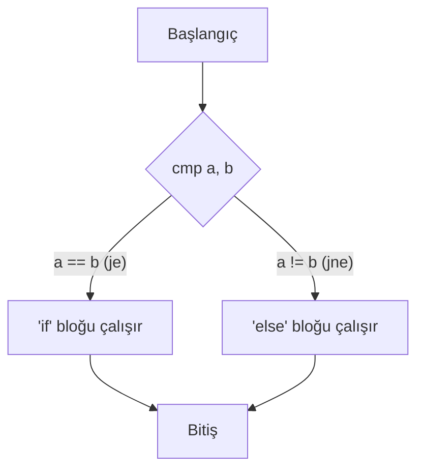
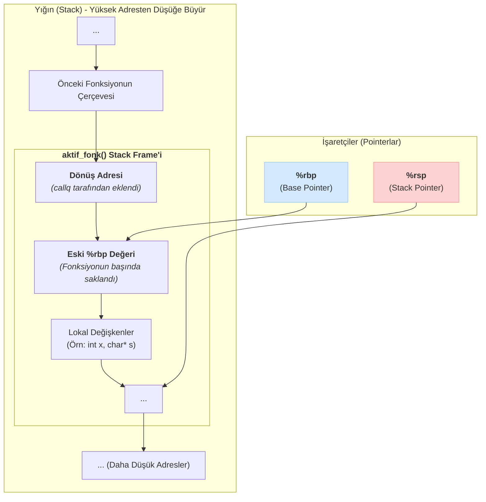

# Aritmetik, Kontrol Akışı ve Prosedürler

Önceki bölümde makine kodunun temellerini öğrendik. Bu bölümde ise bir programı işlevsel kılan üç temel taşı daha inceleyeceğiz: Aritmetik işlemler, `if/else` ve `döngü` gibi kontrol yapıları ve `fonksiyon` çağrıları.

---

## 1. Aritmetik ve Mantıksal Komutlar

`mov`'un yanı sıra, işlemci aritmetik ve mantıksal işlemler için de zengin bir komut setine sahiptir.

### a) İki ve Tek Operandlı Komutlar
`addq S, D` gibi komutlar `D = D + S` şeklinde çalışırken, `incq D` gibi komutlar `D++` işlemini yapar.

| Komut | Açıklama | Komut | Açıklama |
| :--- | :--- | :--- | :--- |
| `addq S, D` | Toplama (`D += S`) | `incq D` | Bir artırma (`D++`) |
| `subq S, D` | Çıkarma (`D -= S`) | `decq D` | Bir eksiltme (`D--`) |
| `imulq S, D`| Çarpma (`D *= S`) | `negq D` | Negatifini alma (`D = -D`) |
| `andq S, D` | Bitwise AND (`D &= S`) | `notq D` | Bitwise NOT (`D = ~D`) |
| `xorq S, D` | Bitwise XOR (`D ^= S`)| | |

Bu komutlar yalnızca register ve bellek içeriklerini değiştirmekle kalmaz, aynı zamanda **condition code**'ları da (ZF, SF, OF, CF) etkiler. Bu sayede, bir sonraki bölümde göreceğimiz `cmp` / `test` ve `j...` dallanma komutları, bu aritmetik işlemlerin sonucuna göre karar verebilir.

### b) `leaq` Komutu: Belleğe Dokunmadan Adres Hesabı Yapma Sanatı
`leaq Source, Destination` (Load Effective Address) komutu, Assembly'nin en ilginç ve güçlü komutlarındandır. Standart `movq` komutunun aksine, bu komut **belleğe gerçekten erişmez.**

`leaq`, `Source` operandının belirttiği *bellek adresini hesaplar* ve bu adresin kendisini `Destination` register'ına yazar.

**`movq` ile `leaq` Arasındaki Temel Fark:**
`%rdi` register'ında `0x100` değeri olduğunu varsayalım.
*   `movq (%rdi), %rax`: Belleğin `0x100` adresine git, oradaki **değeri** oku ve `%rax`'e kopyala.
*   `leaq (%rdi), %rax`: Sadece `(%rdi)` ifadesinin sonucunu, yani `0x100` **adresinin kendisini** `%rax`'e kopyala. Belleğe hiç dokunma.

Bu özelliği sayesinde, toplama ve sınırlı çarpma işlemleri için de dahice bir şekilde kullanılabilir.

*   **Örnek:** `%rax`'ta `x` değeri varken `leaq (%rax, %rax, 2), %rdx` komutu, `%rdx` register'ına `x + x*2`, yani `3*x` değerini yazar. Bu, `imul` komutundan daha hızlı olabilir.

Biraz daha somutlaştıralım:

**Örnek: `x * 3 - 5` Hesabını C ve Assembly ile Yazmak**

**C Kodu:**
```c
long scale3(long x) {
    return x * 3 - 5;
}
```

**Assembly (olası bir çeviri):**
```asm
scale3:
    leaq (%rdi, %rdi, 2), %rax   # %rax = x + 2*x  = 3*x
    subq $5, %rax                # %rax = 3*x - 5
    ret
```

Burada:

*   Parametre `x`, çağrı kuralına göre `%rdi` register'ında gelir.
*   `leaq` komutu, belleğe dokunmadan `3*x` ifadesini hesaplar.
*   `subq $5, %rax` ile sonuçtan `5` çıkarılır ve fonksiyonun dönüş değeri olarak `%rax` içinde bırakılır.

**Question 1:** `leaq 8(%rdi, %rsi, 4), %rax` komutunun yaptığı işlev C dilinde neye en yakındır? (`%rdi`'de `p`, `%rsi`'de `i` olduğunu varsayın)

*   A) `rax = p[i*4 + 8]`
*   B) `rax = p + i + 8`
*   C) `rax = &p[i*4 + 8]` (Adres hesabı)
*   D) `rax = *(p + i*4 + 8)`

<details>
  <summary>Show Answer</summary>
  <p><b>Answer: C.</b> `leaq` komutu "Load Effective Address" anlamına gelir ve bellekten veri okumaz. Sadece adres hesaplaması yapar. Bu ifade, `p + i*4 + 8` adresini hesaplar ve bu adresi (bir pointer değeri olarak) `%rax` register'ına yükler. Bellekten okuma yapan (`*` operatörü) `D` seçeneği, `movq` komutuna karşılık gelirdi.</p>
</details>

---

## 2. Kontrol Akışı: Karşılaştırma ve Zıplama

`if`, `for`, `while` gibi C dilindeki kontrol yapıları, makine seviyesinde iki temel mekanizmayla çalışır: **durum kodlarını ayarlama** ve bu kodlara göre **koşullu zıplama**.

### a) Durum Kodlarını Ayarlama: `cmpq` ve `testq`

İşlemcinin içinde, en son yapılan aritmetik işlemin sonucu hakkında bilgi tutan özel, tek bitlik register'lar bulunur. Bunlara **Condition Codes (Durum Kodları)** denir. En önemlileri şunlardır:

*   **`ZF` (Zero Flag):** Sonuç **sıfır** ise `1` olur.
*   **`SF` (Sign Flag):** Sonuç **negatif** ise `1` olur.
*   **`CF` (Carry Flag):** İşaretsiz (unsigned) bir işlemde **taşma** olduysa `1` olur.
*   **`OF` (Overflow Flag):** İşaretli (signed) bir işlemde **taşma** olduysa `1` olur.

Durum kodlarını, bir sonraki `jump` komutunun karar verebilmesi için ayarlayan iki temel komut vardır:

1.  **`cmpq S2, S1` (Compare):** Arka planda `S1 - S2` işlemini yapar ama sonucu hiçbir yere kaydetmez. Sadece bu çıkarma işleminin sonucuna göre durum kodlarını ayarlar.
    *   Kullanım: `if (x == y)`, `if (x > y)` gibi karşılaştırmalar için.
    *   `cmpq %rax, %rsi` -> `ZF=1` ise `%rsi == %rax` demektir.

2.  **`testq S2, S1` (Test):** Arka planda `S1 & S2` (bitwise AND) işlemini yapar ve sonucu kaydetmez. Sadece bu AND işleminin sonucuna göre `ZF` ve `SF`'yi ayarlar.
    *   Kullanım: Bir sayının belirli bitlerini kontrol etmek veya sayının sıfır olup olmadığını anlamak için çok verimlidir.
    *   `testq %rax, %rax` -> `ZF=1` ise `%rax == 0` demektir.

Aşağıdaki tablo, bu iki komutun tipik kullanım farkını özetler:

| Komut        | Yaptığı İş              | Tipik Kullanım                     |
| :----------- | :---------------------- | :--------------------------------- |
| `cmpq S2,S1` | `S1 - S2` sonucu ile CC | `if (a < b)`, `if (x == y)`       |
| `testq S2,S1`| `S1 & S2` sonucu ile CC | `if (x != 0)`, bit mask kontrolü  |

### b) Koşullu Zıplama (Conditional Jumps)

`j...` ile başlayan komutlar, durum kodlarının o anki değerine bakarak programın akışını farklı bir **etikete (label)** yönlendirir.

*   `jmp Etiket`: Koşulsuz zıpla.
*   `je Etiket` (Jump if Equal): Eşitse zıpla (`ZF=1`).
*   `jne Etiket` (Jump if Not Equal): Eşit değilse zıpla (`ZF=0`).
*   `js Etiket` (Jump if Sign): Sonuç negatifse zıpla (`SF=1`).
*   `jg Etiket` (Jump if Greater): İşaretli "büyükse" zıpla (`ZF=0` ve `SF==OF`).
*   `ja Etiket` (Jump if Above): İşaretsiz "büyükse" zıpla (`CF=0` ve `ZF=0`).

Bu mekanizma, `if-else` gibi yapıların temelini oluşturur:



**Question 1:** `%rax` register'ında 5, `%rbx` register'ında 10 değeri varken, `cmpq %rax, %rbx` komutu çalıştırıldıktan sonra durum kodlarından hangisi `1` olur?

*   A) `ZF (Zero Flag)`
*   B) `SF (Sign Flag)`
*   C) `OF (Overflow Flag)`
*   D) Hiçbiri

<details>
  <summary>Show Answer</summary>
  <p><b>Answer: B.</b> `cmpq S2, S1` komutu `S1 - S2` işlemini yapar. Yani, `10 - 5` değil, `%rbx - %rax` (`10-5`) değil `5-10` yapılır. Sonuç `-5` olduğu için `SF` (Sign Flag) `1` olur.</p>
</details>

**Question 2:** Aşağıdaki kod parçası, C dilindeki hangi koşula en yakındır?

```
testq %rdi, %rdi
je   .Lnull
```

*   A) `if (p == NULL)`
*   B) `if (p != NULL)`
*   C) `if (*p == 0)`
*   D) `if (*p != 0)`

<details>
  <summary>Show Answer</summary>
  <p><b>Answer: A.</b> `testq %rdi, %rdi` komutu pratikte `cmpq $0, %rdi` ile aynı etkiyi yaratır: Eğer `%rdi == 0` ise `ZF=1` olur. Ardından gelen `je` komutu, sadece ZF=1 iken dallandığı için bu yapı, C dilindeki `if (p == NULL)` koşuluna karşılık gelir.</p>
</details>

---

## 3. Prosedürler (Fonksiyonlar) ve Program Yığını (The Stack)

Fonksiyon çağrıları, belleğin "son giren ilk çıkar" (LIFO) prensibiyle çalışan **yığın (stack)** bölgesi tarafından yönetilir. Stack, **yüksek bellek adreslerinden alçak adreslere doğru** büyür.

İki önemli register bu süreci yönetir:
*   `%rsp` (Stack Pointer): Her zaman yığının en "tepesinin" (en son eklenen elemanın) adresini tutar.
*   `%rbp` (Base Pointer): Çağrılan fonksiyonun kendi çalışma alanının (stack frame) taban adresini işaretlemek için kullanılır. Bu, fonksiyonun kendi yerel değişkenlerine ve aldığı argümanlara tutarlı bir şekilde erişmesini sağlar.

### a) Çağrı ve Geri Dönüş Mekanizması

1.  **`callq my_func`:** Bu komut iki temel iş yapar:
    1.  `callq`'dan bir sonraki komutun adresini (**dönüş adresi**) yığına `push` eder. Bu, fonksiyon bittiğinde nereye geri döneceğini bilmesini sağlar.
    2.  Programın kontrolünü `my_func` etiketindeki komuta zıplatarak aktarır.

2.  **`retq`:** Bu komut da iki temel iş yapar:
    1.  Yığının tepesindeki dönüş adresini bir register'a `pop` eder.
    2.  Programın kontrolünü o adrese zıplatarak geri verir.

### b) Yığın Çerçevesi (Stack Frame)

Bir fonksiyon çağrıldığında, yığın üzerinde kendine ait, **yığın çerçevesi (stack frame)** adı verilen özel bir çalışma alanı oluşturulur. Bu çerçeve, fonksiyonun çalışması için gereken her şeyi barındırır.


Bu yapı sayesinde, bir fonksiyon diğerini çağırdığında (ve o da bir başkasını), her birinin kendi özel değişken alanı olur ve program karışıklık olmadan çalışır.

### Örnek: Basit Bir Fonksiyonun Stack Frame'i

Aşağıdaki fonksiyonun nasıl bir çerçeve (stack frame) oluşturduğunu inceleyelim:

**C Kodu:**
```c
long sum2(long x, long y) {
    long z = x + y;
    return z;
}
```

**Olası Assembly (özetlenmiş):**
```asm
sum2:
    pushq %rbp           # Eski %rbp'yi sakla
    movq  %rsp, %rbp     # Yeni frame'in tabanı = eski stack tepesi
    subq  $16, %rsp      # (İsteğe bağlı) yerel değişkenler için alan aç

    movq  %rdi, -8(%rbp) # x'i stack'e kaydet
    movq  %rsi, -16(%rbp)# y'yi stack'e kaydet

    movq  -8(%rbp), %rax # %rax = x
    addq  -16(%rbp), %rax# %rax = x + y

    leave                # mov %rbp,%rsp; pop %rbp
    ret                  # Dönüş adresine zıpla
```

Bu örnekte:

*   `%rbp` aktif fonksiyonun çerçevesi için sabit bir referans noktası (anchor) oluşturur.
*   `leave` komutu, fonksiyon sonunda stack frame'i temizleyip eski `%rbp` değerini geri yükler.

**Question 1:** Bir C kodunda `if (x > 0)` kontrolü yapılacaktır. `%rax` register'ında `x`'in değeri tutuluyorsa, bu kontrolü yapmak için hangi Assembly komutları en mantıklısıdır?

*   A) `movq $0, %rax` ve `je .zero_label`
*   B) `testq %rax, %rax` ve `jle .not_positive_label`
*   C) `addq $1, %rax` ve `js .negative_label`
*   D) `leaq (%rax), %rax` ve `jmp .loop_label`

<details>
  <summary>Show Answer</summary>
  <p><b>Answer: B.</b> Bir sayının sıfır veya negatif olup olmadığını kontrol etmenin en verimli yollarından biri `testq` komutudur. 
  ```
testq %rax, %rax  # %rax & %rax işlemini yap. Sonuç 0 ise ZF=1, negatifse SF=1 olur.
jle .not_positive_label # "Jump if Less or Equal". ZF=1 (eşitse) veya SF=1 (küçükse) zıpla.
  ```
  Bu kod bloğu, `x <= 0` durumunda etikete zıplar, bu da `x > 0` kontrolünün tam tersidir ve `if` bloklarını uygulamak için yaygın bir yöntemdir.</p>
</details>

**Question 2:** `main` fonksiyonu içinden `sum(a, b)` fonksiyonuna `callq sum` komutuyla bir çağrı yapılıyor. `sum` fonksiyonu işini bitirip `retq` komutunu çalıştırdığında programın akışı nereye döner?

*   A) `main` fonksiyonunun en başına.
*   B) Programın sonuna.
*   C) `main` içindeki `callq sum` komutundan hemen sonraki komuta.
*   D) `sum` fonksiyonunun en başına.

<details>
  <summary>Show Answer</summary>
  <p><b>Answer: C.</b> `callq` komutu çalıştırılmadan hemen önce, bir sonraki komutun adresi ("dönüş adresi") yığına (stack) kaydedilir. `retq` komutunun tek görevi, yığındaki bu adresi alıp programı oradan devam ettirmektir. Bu mekanizma, fonksiyonların çağrıldıkları yere geri dönebilmelerini sağlar.</p>
</details>

**Question 3:** `%rbp` (Base Pointer) register'ının temel amacı nedir?

*   A) Yığının en tepesini göstermek.
*   B) Aktif fonksiyonun yığın çerçevesinin (stack frame) tabanını işaretleyerek lokal değişkenlere ve argümanlara sabit bir noktadan erişim sağlamak.
*   C) Bir sonraki çalıştırılacak komutun adresini tutmak.
*   D) Fonksiyonun dönüş değerini saklamak.

<details>
  <summary>Show Answer</summary>
  <p><b>Answer: B.</b> `%rsp` (Stack Pointer) yığına eleman eklenip çıkarıldıkça sürekli hareket eder. Bu nedenle, fonksiyonun kendi değişkenlerine `%rsp`'ye göre erişmek karmaşık olurdu. `%rbp` ise fonksiyon boyunca sabit kalarak, tüm lokal değişkenlere ve argümanlara bilinen, sabit bir ofsetle (`-8(%rbp)` gibi) erişilmesini sağlayan güvenilir bir "çapa" (anchor) görevi görür.</p>
</details>

**Question 4:** Aşağıdaki iki komut birlikte çalıştırıldığında hangi işlemi gerçekleştirir?

```
leave
ret
```

*   A) Yalnızca fonksiyonun dönüş değerini ayarlar.
*   B) Sadece eski `%rbp` değerini geri yükler.
*   C) Aktif stack frame'i temizler ve çağıran fonksiyona geri döner.
*   D) Yerel değişkenleri sıfırlar.

<details>
  <summary>Show Answer</summary>
  <p><b>Answer: C.</b> `leave` komutu, özetle `mov %rbp, %rsp` ve `pop %rbp` işlemlerini yaparak mevcut stack frame'i temizler. Ardından `ret` komutu, stack'teki dönüş adresini alıp programın kontrolünü çağıran fonksiyona devreder.</p>
</details>

---

## 4. Örnek: C Kodundan Assembly'ye Tam Bir Dönüşüm

Şimdiye kadar öğrendiğimiz tüm parçaları birleştirelim ve basit bir C programının baştan sona nasıl Assembly'ye dönüştüğünü inceleyelim.

### a) Kaynak C Kodu

```c
// temp_example.c
int topla(int a, int b) {
    int sonuc = a + b;
    return sonuc;
}

int main() {
    int z = topla(10, 20);
    return z;
}
```

### b) Üretilen Assembly Kodu ve Analizi

Bu C kodunu `gcc -O1 -S` gibi bir komutla derlediğimizde, aşağıdaki gibi bir Assembly dosyası elde ederiz. Her bölümü satır satır inceleyelim.

#### `topla` Fonksiyonu

```asm
topla:
    leal    (%rdi,%rsi), %eax
    ret
```

*   **Satır 1: `topla:`** - Bu bir etikettir ve `topla` fonksiyonunun başlangıç adresini belirtir.
*   **Satır 2: `leal (%rdi,%rsi), %eax`** - Bu satır, derleyicinin yaptığı zekice bir optimizasyondur.
    *   x86-64 çağrı kurallarına göre, ilk iki `int` argümanı olan `a` ve `b`, sırasıyla 32-bit'lik `%edi` ve `%esi` register'larına (64-bit'lik `%rdi` ve `%rsi`'nin alt kısımları) yerleştirilir.
    *   `leal` komutu, normalde adres hesabı yapar. `(%rdi, %rsi)` ifadesi, `%rdi` ve `%rsi`'nin değerlerini toplar. `leal` bu toplam sonucunu (belleğe gitmeden) doğrudan `%eax` register'ına yazar. `%eax`, fonksiyonların 32-bit dönüş değerleri için kullanılan standart register'dır.
    *   Yani bu tek komut, `int sonuc = a + b;` ve `return sonuc;` işlemlerinin ikisini birden yapmış olur.
*   **Satır 3: `ret`** - Fonksiyondan geri döner. `call` komutunun yığına yazdığı dönüş adresine zıplar.

#### `main` Fonksiyonu

```asm
main:
    movl    $20, %esi
    movl    $10, %edi
    call    topla
    ret
```

*   **Satır 1: `main:`** - Programın başlangıç noktası olan `main` fonksiyonunun etiketidir.
*   **Satır 2: `movl $20, %esi`** - `topla` fonksiyonunun ikinci argümanı (`b=20`) olan `20` sabit değerini, ikinci argüman register'ı olan `%esi`'ye yükler.
*   **Satır 3: `movl $10, %edi`** - `topla` fonksiyonunun ilk argümanı (`a=10`) olan `10` sabit değerini, ilk argüman register'ı olan `%edi`'ye yükler.
*   **Satır 4: `call topla`** - `topla` fonksiyonunu çağırır. Bu komut, bir sonraki komutun (`ret`) adresini yığına kaydeder ve programın akışını `topla` etiketine yönlendirir.
*   **Satır 5: `ret`** - `topla` fonksiyonu işini bitirip geri döndüğünde, `%eax` register'ında `30` değeri bulunur. `main` fonksiyonu da bu değeri işletim sistemine dönüş değeri olarak kullanarak sonlanır.

**Question 1:** Yukarıdaki `main` fonksiyonunda, `call topla` komutu çalıştırılmadan hemen önce `%rdi` ve `%rsi` register'ları hangi değerleri içerir?

*   A) `20` ve `10`
*   B) `x` ve `y`'nin bellek adreslerini
*   C) `10` ve `20`
*   D) `0` ve `0`

<details>
  <summary>Show Answer</summary>
  <p><b>Answer: C.</b> x86-64 çağrı kurallarına göre, bir fonksiyona geçirilen ilk tamsayı argümanı `%rdi`'ye (veya 32-bit ise `%edi`'ye), ikincisi ise `%rsi`'ye (veya `%esi`'ye) yerleştirilir. Derleyici, `topla(10, 20)` çağrısı için `10`'u `%edi`'ye ve `20`'yi `%esi`'ye yükler.</p>
</details>

**Question 2:** `topla` fonksiyonu neden `pushq %rbp` ve `movq %rsp, %rbp` gibi stack frame kurma komutlarını kullanmamıştır?

*   A) Çünkü `main` fonksiyonu tarafından çağrılmıştır.
*   B) Çünkü fonksiyon çok basittir; herhangi bir lokal değişken için yığına (stack) ihtiyaç duymamış ve başka bir fonksiyonu çağırmamıştır.
*   C) Modern derleyiciler artık stack frame kullanmaz.
*   D) Çünkü dönüş değeri bir register ile döndürülmüştür.

<details>
  <summary>Show Answer</summary>
  <p><b>Answer: B.</b> Stack frame kurmak, özellikle fonksiyonun kendi lokal değişkenleri varsa veya başka fonksiyonları çağıracaksa (dönüş adresini korumak için) gereklidir. `topla` fonksiyonu o kadar basittir ki, tüm işlemlerini sadece register'lar üzerinde yapabilir. `-O1` gibi optimizasyon seviyelerinde derleyici, bu gereksiz stack operasyonlarını koddan çıkararak daha verimli bir makine kodu üretir. Bu tür fonksiyonlara "leaf function" (yaprak fonksiyon) denir.</p>
</details>

---

## 5. Döngü Yapıları: Fibonacci Örneği

`for` ve `while` gibi döngü yapıları, Assembly'de `if` yapılarına benzer şekilde, koşullu dallanma (`j...`) ve koşulsuz zıplama (`jmp`) komutlarının bir kombinasyonuyla oluşturulur. Bunu iteratif bir Fibonacci fonksiyonu üzerinden inceleyelim.

### a) Kaynak C Kodu (İteratif Fibonacci)

```c
int fib(int n) {
    if (n <= 1) {
        return n;
    }
    int prev = 0;
    int current = 1;
    for (int i = 2; i <= n; i++) {
        int next = prev + current;
        prev = current;
        current = next;
    }
    return current;
}
```

### b) Üretilen Assembly Kodu ve Analizi

```asm
fib:
    cmpl    $1, %edi
    jle     .L_return_n
    movl    $0, %ecx       ; prev = 0
    movl    $1, %eax       ; current = 1
    movl    $2, %edx       ; i = 2
.L_loop_start:
    cmpl    %edi, %edx     ; i <= n kontrolü (n - i)
    jg      .L_loop_end
    leal    (%rcx,%rax), %esi ; next = prev + current
    movl    %eax, %ecx     ; prev = current
    movl    %esi, %eax     ; current = next
    addl    $1, %edx       ; i++
    jmp     .L_loop_start
.L_return_n:
    movl    %edi, %eax     ; return n;
    ret
.L_loop_end:
    ret
```

*   **Satır 2-3: `cmpl $1, %edi` / `jle .L_return_n`**
    *   `if (n <= 1)` kontrolü yapılır. Argüman `n` (`%edi` içinde) `1` ile karşılaştırılır. Eğer küçük veya eşitse (`jle`), `.L_return_n` etiketine zıplanır.
*   **Satır 4-6: `movl ...`**
    *   Döngü değişkenleri başlatılır: `prev` (`%ecx`), `current` (`%eax`), `i` (`%edx`). `current`'ın dönüş değeri register'ı olan `%eax`'e konması bir optimizasyondur.
*   **Satır 7: `.L_loop_start:`** - Döngünün başlangıcını işaret eden etiket.
*   **Satır 8-9: `cmpl %edi, %edx` / `jg .L_loop_end`**
    *   `for` döngüsünün `i <= n` koşulu kontrol edilir. `cmp` komutu `i - n` işlemini yapar. Eğer `i > n` ise (`jg` - jump if greater), döngü biter ve `.L_loop_end` etiketine zıplanır.
*   **Satır 10-12: `leal`, `movl`, `movl`**
    *   Döngü içindeki üç atama işlemi yapılır: `next = prev + current`, `prev = current`, `current = next`.
*   **Satır 13: `addl $1, %edx`**
    *   Döngü sayacı `i` bir artırılır (`i++`).
*   **Satır 14: `jmp .L_loop_start`**
    *   Koşulsuz olarak döngünün başına zıplanır ve kontrol tekrar yapılır.
*   **Satır 15-17: `.L_return_n`**
    *   `n <= 1` ise çalışacak blok. `n`'nin orijinal değeri (`%edi` içinde) dönüş register'ı `%eax`'e kopyalanır ve fonksiyon `ret` ile sonlanır.
*   **Satır 18: `.L_loop_end:`**
    *   Döngü bittiğinde, `current`'ın son değeri zaten `%eax`'te olduğu için doğrudan `ret` komutuyla geri dönülür.
