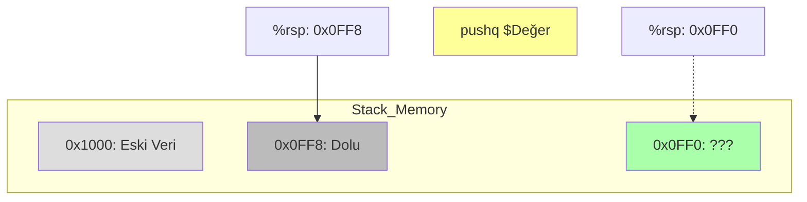

# Arithmetic & Control
{: .no_toc }

İşlemci nasıl hesap yapar, karar verir (if/else) ve döngü kurar?

## İçindekiler
{: .no_toc .text-delta }

1. TOC
{:toc}

---

## 1. `leaq`: The Swiss Army Knife

`leaq` (Load Effective Address) aslında bir hafıza komutu gibi görünür ama işlemcideki en hızlı aritmetikçidir.

*   **Amaç:** Adres hesaplamak ($D + R_b + R_i \times S$).
*   **Hile:** Bu formülü sadece sayıları çarpmak ve toplamak için kullanır. **Belleğe GİTMEZ.**

{: .highlight }
> **Örnek:** `x * 12` hesaplamak.
> 1. `leaq (%rdi, %rdi, 2), %rax` $\to$ `rax = x + x*2` = **3x**
> 2. `shlq $2, %rax` $\to$ `rax = 3x << 2` = $3x \times 4$ = **12x**

---

## 2. Condition Codes (Flags)

İşlemci son yaptığı aritmetik işlemden sonra "notlar" alır. Bu notlar 1 bitlik `RFLAGS` registerında tutulur.

| Flag | İsim | Anlamı | Hangi Durumda 1 Olur? |
|:---:|:---|:---|:---|
| **ZF** | Zero Flag | Sonuç Sıfır | `res == 0` |
| **SF** | Sign Flag | Sonuç Negatif | `res < 0` (MSB == 1) |
| **CF** | Carry Flag | Unsigned Overflow | Elde var (Unsigned sınırını aştı) |
| **OF** | Overflow Flag | Signed Overflow | `Pos + Pos = Neg` veya `Neg + Neg = Pos` |

### `cmp` ve `test` Komutları
Bu komutlar işlem yapar ama **sonucu kaydetmez**, sadece Flagleri günceller.

*   **`cmpq b, a`**: `a - b` hesaplar. (`subq` gibi ama `a` değişmez).
    *   Kullanım: `if (a == b)`
*   **`testq b, a`**: `a & b` hesaplar. (`andq` gibi ama `a` değişmez).
    *   Kullanım: `testq %rax, %rax` (Hızlıca "sıfır mı, negatif mi" kontrolü).

---

## 3. Jumps (Zıplamalar)

Flaglere bakarak kodun akışını değiştiren komutlardır.

| Jump | Okunuşu | Koşul | Açıklama |
|:---|:---|:---|:---|
| `jmp` | Jump | 1 | Koşulsuz şartsız git. |
| `je` / `jz` | Jump Equal / Zero | ZF=1 | Eşitse (veya sonuç sıfırsa). |
| `jne` / `jnz` | Jump Not Equal | ZF=0 | Eşit değilse. |
| `js` | Jump Signed | SF=1 | Negatifse. |
| `jg` | Jump Greater | ~(SF^OF) & ~ZF | Büyüktür (Signed). |
| `ja` | Jump Above | ~CF & ~ZF | Büyüktür (Unsigned). |

{: .warning }
> **Signed vs Unsigned Jumps:**
> *   Signed karşılaştırma için: `jg` (Greater), `jl` (Less).
> *   Unsigned karşılaştırma için: `ja` (Above), `jb` (Below).
> Yanlış jump kullanmak mantık hatasına yol açar!

---

## 4. The Stack (Yığın)

Hafızanın özel bir bölgesidir. Fonksiyon çağırma (Function Calls) ve yerel değişkenler burada yönetilir.

*   **Yön:** Yüksek adresten düşük adrese doğru (Downwards) büyür.
*   **%rsp:** Stack Pointer. En son eklenen elemanın adresini (Stack Top) tutar.

### Push ve Pop İşlemleri (Görsel)

*   **`pushq Src`**:
    1.  `%rsp`'yi 8 azalt (`%rsp -= 8`).
    2.  Değeri o adrese yaz.
*   **`popq Dest`**:
    1.  Değeri `%rsp` adresinden oku.
    2.  `%rsp`'yi 8 artır (`%rsp += 8`).

---

## 5. Alıştırmalar (Self-Quiz)

<strong>Soru 1:</strong> <code>testq %rax, %rax</code> komutu ne zaman ZF (Zero Flag) set eder?

 
Cevap: <strong>%rax sıfır olduğunda.</strong>
<code>0 & 0 = 0</code> olduğu için sonuç sıfır çıkar ve ZF=1 olur. Bu, bir registerın 0 olup olmadığını kontrol etmenin en hızlı yoludur.

<strong>Soru 2:</strong> Stack pointer <code>0x108</code> iken <code>pushq %rax</code> çalışırsa yeni stack pointer ne olur?

 
Cevap: <strong>0x100</strong>.
Stack aşağı (küçük adreslere) büyür. 64-bit sistemde her eleman 8 byte'tır. <code>0x108 - 8 = 0x100</code>.

<strong>Soru 3:</strong> <code>cmpq %rsi, %rdi</code> yaptık (yani <code>rdi - rsi</code>). Sonuç pozitif ama Overflow Flag (OF) yandı. Bu ne anlama gelir?

 
Cevap: <strong>Gerçek sonuç aslında negatiftir.</strong>
Signed Overflow (OF) olduysa işaretler karışmıştır. Pozitif - Negatif = Pozitif (ama taşma sonucu negatif görünebilir veya tam tersi).
Matematiksel olarak: <code>rdi < rsi</code>.

