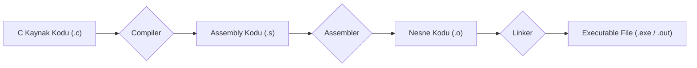

# Makine Kodu Temelleri: C'den Assembly'ye

Yazdığımız C kodu, işlemci tarafından doğrudan anlaşılamaz. Bir **compiler (derleyici)**, bu insan tarafından okunabilir kodu, işlemcinin yürütebileceği düşük seviyeli **machine instructions (makine komutlarına)** dönüştürür. Bu komutların insan tarafından okunabilir gösterimine **Assembly dili** denir. Bu bölümde, bu dönüşüm sürecini ve Assembly dilinin temellerini inceleyeceğiz.

---

## 1. Derleme Süreci: Koddan Yürütülebilir Dosyaya

Bir C programını derlediğimizde aslında birkaç adımlık bir süreç işler:

1.  **C Kodu (`program.c`):** Yazdığımız kaynak kod.
2.  **Compiler:** Kaynak kodu Assembly diline çevirir.
3.  **Assembler:** Assembly kodunu, makine tarafından okunabilen ikili **object code (nesne koduna)** dönüştürür.
4.  **Linker:** Nesne kodunu, `printf` gibi kütüphane fonksiyonlarıyla birleştirerek son **executable (yürütülebilir dosyayı)** oluşturur.



<div class="quiz-question">
  <p><b>Soru:</b> Bir C programını derlerken, Assembly kodunu (`.s` dosyası) görmek için `gcc`'ye hangi parametre verilir?</p>
  <div class="quiz-option">A) `-c`</div>
  <div class="quiz-option">B) `-o`</div>
  <div class="quiz-option" data-correct="true">C) `-S`</div>
  <div class="quiz-option">D) `-E`</div>
  <div class="quiz-explanation">
    <p><b>Cevap: C.</b> `gcc -S program.c` komutu, derleme işlemini Assembly kodu ürettikten sonra durdurur ve `program.s` adlı bir dosya oluşturur.</p>
  </div>
</div>

---

## 2. Assembly Programcısının Gözünden Donanım

Assembly seviyesinde, C'deki soyut değişkenler yerine işlemcinin donanım kaynaklarını görürüz:

*   **Program Counter (PC / `RIP`):** Yürütülecek bir sonraki komutun bellek adresini tutan özel bir register.
*   **Registers:** İşlemcinin içindeki çok hızlı, küçük depolama birimleri.
*   **Condition Codes (Durum Kodları):** En son yapılan işlemin sonucu hakkında bilgi tutan tek bitlik bayraklar (sonuç sıfır mıydı, negatif miydi vb.).
*   **Memory (Bellek):** Kod, global değişkenler ve stack gibi verilerin tutulduğu büyük bir bayt dizisi.

---

## 3. x86-64 Mimarisi ve Register'lar

Günümüzdeki çoğu işlemci **x86-64** mimarisini kullanır ve 16 adet genel amaçlı 64-bit'lik register sunar.

| Register Adı | Tipik Kullanım Amacı |
| :--- | :--- |
| `%rax` | Fonksiyon dönüş değeri |
| `%rdi`, `%rsi`, `%rdx`, `%rcx`, `%r8`, `%r9` | Fonksiyon argümanları (ilk altı) |
| `%rsp` | Stack (Yığın) işaretçisi |

<div class="quiz-question">
  <p><b>Soru:</b> x86-64 mimarisinde, bir fonksiyondan dönen tamsayı veya pointer değeri tipik olarak hangi register'da bulunur?</p>
  <div class="quiz-option" data-correct="true">A) `%rax`</div>
  <div class="quiz-option">B) `%rsp`</div>
  <div class="quiz-option">C) `%rdi`</div>
  <div class="quiz-option">D) `%rbp`</div>
  <div class="quiz-explanation">
    <p><b>Cevap: A.</b> Çağrı kurallarına göre, fonksiyonun dönüş değeri `%rax` register'ına yerleştirilerek çağıran fonksiyona döndürülür.</p>
  </div>
</div>

---

## 4. Temel Komut: `mov` (Veri Taşıma)

Assembly'deki en temel komutlardan biri `mov`'dur. Bir değeri bir yerden başka bir yere kopyalar. Komut, veri boyutunu belirten bir sonek alır: `movb` (1 byte), `movl` (4 byte), `movq` (8 byte).

**`movq Kaynak, Hedef`**

*   **Source (Kaynak):**
    *   **Immediate (Sabit):** `$0x100` gibi dolar işaretiyle başlayan sabit bir değer.
    *   **Register:** `%rax` gibi bir register.
    *   **Memory (Bellek):** `(%rax)` gibi parantez içinde bir adres.
*   **Destination (Hedef):**
    *   **Register:** `%rbx` gibi bir register.
    *   **Memory (Bellek):** `(%rbx)` gibi bir adres.

**Kısıtlama:** Tek bir `mov` komutuyla bellekten belleğe doğrudan veri kopyalamak mümkün değildir. Veri önce bir register'a alınmalı, sonra o register'dan hedefe yazılmalıdır.

---

## 5. Adresleme Modları ve `swap` Örneği

Belleğe erişmenin farklı yollarına **adresleme modları** denir. Bu modlar, C'deki pointer ve dizi işlemlerini mümkün kılar.

| Mod | Açıklama | Örnek |
| :--- | :--- | :--- |
| Normal | Parantez içindeki register adres olarak kullanılır | `(%rcx)` |
| Displacement | Register'a bir sabit eklenerek adres bulunur | `8(%rbp)` |
| Indexed w/ Scale | `Sabit + Register1 + Register2 * Olcek` | `8(%rax, %rcx, 4)` |

### C'den Assembly'ye Örnek: `swap`

```c
void swap(long *xp, long *yp) {
    long t0 = *xp;
    long t1 = *yp;
    *xp = t1;
    *yp = t0;
}
```
*   `xp`'nin adresi `%rdi`'de, `yp`'nin adresi `%rsi`'dedir.

```assembly
swap:
    movq  (%rdi), %rax   # t0 = *xp; (xp adresindeki degeri rax'e tasi)
    movq  (%rsi), %rdx   # t1 = *yp; (yp adresindeki degeri rdx'e tasi)
    movq  %rdx, (%rdi)   # *xp = t1; (rdx'deki degeri xp adresine yaz)
    movq  %rax, (%rsi)   # *yp = t0; (rax'deki degeri yp adresine yaz)
    ret                  # Fonksiyondan don
```

Bu örnekte, `(%rdi)` ve `(%rsi)` ifadeleri **Normal Adresleme Modu**'nu kullanarak `xp` ve `yp` pointer'larının gösterdiği bellek alanlarına erişir.

<div class="quiz-question">
  <p><b>Soru:</b> `%rax` register'ında `0x100`, `%rbx` register'ında ise `0x10` değeri olduğunu varsayalım. `movq 8(%rax, %rbx, 4), %rcx` komutu çalıştırıldığında, `%rcx` register'ına hangi bellek adresindeki veri kopyalanır?</p>
  <div class="quiz-option">A) `0x118`</div>
  <div class="quiz-option">B) `0x148`</div>
  <div class="quiz-option" data-correct="true">C) `0x148` adresindeki veri</div>
  <div class="quiz-option">D) Bu komut geçersizdir</div>
  <div class="quiz-explanation">
    <p><b>Cevap: C.</b> Adres hesaplaması `Sabit + Register1 + Register2 * Olcek` formülüne göre yapılır: `8 + 0x100 + 0x10 * 4` = `8 + 256 + 16 * 4` = `8 + 256 + 64` = `328`, yani `0x148`. Komut, bu hesaplanan **adresteki 8 baytlık veriyi** `%rcx` register'ına kopyalar.</p>
  </div>
</div>

<div class="quiz-question">
  <p><b>Soru:</b> Yukarıdaki `swap` fonksiyonunda, ilk iki `movq` komutundan sonra `%rax` ve `%rdx` register'ları hangi değerleri tutar?</p>
  <div class="quiz-option">A) `xp` ve `yp`'nin bellek adreslerini</div>
  <div class="quiz-option" data-correct="true">B) `xp` ve `yp`'nin gösterdiği yerdeki değerleri</div>
  <div class="quiz-option">C) `t0` ve `t1`'in bellek adreslerini</div>
  <div class="quiz-option">D) `%rdi` ve `%rsi`'nin kendisini</div>
  <div class="quiz-explanation">
    <p><b>Cevap: B.</b> `movq (%rdi), %rax` komutu, `%rdi`'nin **içindeki adrese gider** ve o adresteki 8 byte'lık değeri `%rax`'e kopyalar. Yani `*xp` işlemini yapar. Aynı durum `%rdx` için de geçerlidir.</p>
  </div>
</div>

---
