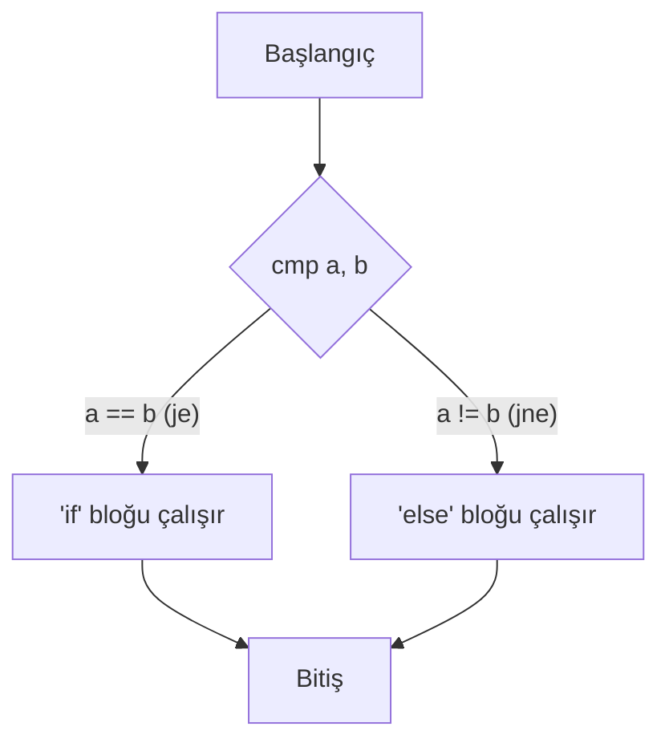
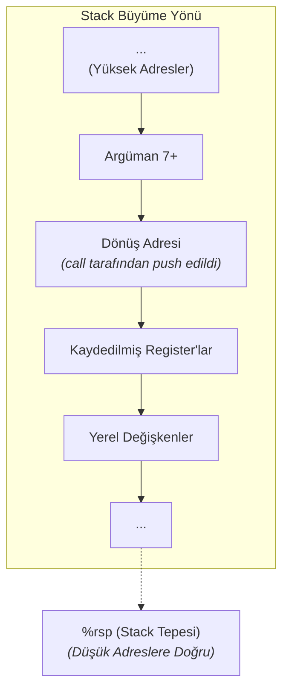

# Aritmetik, Kontrol Akışı ve Prosedürler

Önceki bölümde makine kodunun temellerini öğrendik. Bu bölümde ise bir programı işlevsel kılan üç temel taşı daha inceleyeceğiz: Aritmetik işlemler, `if/else` ve `döngü` gibi kontrol yapıları ve `fonksiyon` çağrıları.

---

## 1. Aritmetik ve Mantıksal Komutlar

`mov`'un yanı sıra, işlemci aritmetik ve mantıksal işlemler için de zengin bir komut setine sahiptir.

### a) İki ve Tek Operandlı Komutlar
`addq S, D` gibi komutlar `D = D + S` şeklinde çalışırken, `incq D` gibi komutlar `D++` işlemini yapar.

| Komut | Açıklama | Komut | Açıklama |
| :--- | :--- | :--- | :--- |
| `addq S, D` | Toplama (`D += S`) | `incq D` | Bir artırma (`D++`) |
| `subq S, D` | Çıkarma (`D -= S`) | `decq D` | Bir eksiltme (`D--`) |
| `imulq S, D`| Çarpma (`D *= S`) | `negq D` | Negatifini alma (`D = -D`) |
| `andq S, D` | Bitwise AND (`D &= S`) | `notq D` | Bitwise NOT (`D = ~D`) |
| `xorq S, D` | Bitwise XOR (`D ^= S`)| | |

### b) `leaq` Komutu: Adres Hesabı Sanatı
`leaq Source, Destination` (Load Effective Address) komutu, Assembly'nin en ilginç komutlarındandır. `Source` operandının belirttiği *bellek adresini hesaplar* ve sonucu `Destination` register'ına yazar. **Belleğe gerçekten erişmez, sadece adres matematiği yapar.**

Bu özelliği sayesinde, toplama ve sınırlı çarpma işlemleri için dahice bir şekilde kullanılabilir.

*   **Örnek:** `%rax`'ta `x` değeri varken `leaq (%rax, %rax, 2), %rdx` komutu, `%rdx` register'ına `x + x*2`, yani `3*x` değerini yazar. Bu, `imul` komutundan daha hızlı olabilir.

  
<b>Soru:</b> `leaq 8(%rdi, %rsi, 4), %rax` komutunun yaptığı işlev C dilinde neye en yakındır? (`%rdi`'de `p`, `%rsi`'de `i` olduğunu varsayın)

  
A) `rax = p[i*4 + 8]`

  
B) `rax = p + i + 8`

  
C) `rax = &p[i*4 + 8]` (Adres hesabı)

  
D) `rax = *(p + i*4 + 8)`

  

    
<b>Cevap: C.</b> `leaq` komutu "Load Effective Address" anlamına gelir ve bellekten veri okumaz. Sadece adres hesaplaması yapar. Bu ifade, `p + i*4 + 8` adresini hesaplar ve bu adresi (bir pointer değeri olarak) `%rax` register'ına yükler. Bellekten okuma yapan (`*` operatörü) `D` seçeneği, `movq` komutuna karşılık gelirdi.

  

---

## 2. Kontrol Akışı: Karşılaştırma ve Zıplama

`if`, `while` gibi yapılar, **karşılaştırma** ve **koşullu zıplama** mekanizmalarıyla çalışır.

1.  **Karşılaştırma:** `cmpq S2, S1` komutu, `S1 - S2` işlemini yapar ancak sonucu bir yere yazmaz. Sadece işlemin sonucuna göre **condition codes (durum kodlarını)** ayarlar.
    *   **ZF (Zero Flag):** Sonuç sıfır ise `1` olur (`S1 == S2`).
    *   **SF (Sign Flag):** Sonuç negatif ise `1` olur (`S1 < S2`).
    *   **OF (Overflow Flag):** İşaretli taşma olduysa `1` olur.

2.  **Zıplama (Jump):** `j...` komutları, durum kodlarına bakarak programın akışını farklı bir etikete yönlendirir.
    *   `jmp Etiket`: Koşulsuz zıpla.
    *   `je Etiket` (Jump if Equal): Eşitse zıpla (`ZF=1`).
    *   `jne Etiket` (Jump if Not Equal): Eşit değilse zıpla (`ZF=0`).
    *   `jg Etiket` (Jump if Greater): İşaretli "büyükse" zıpla.
    *   `ja Etiket` (Jump if Above): İşaretsiz "büyükse" zıpla.

Bu mekanizma, `if-else` gibi yapıların temelini oluşturur. Aşağıdaki diyagram, bu mantıksal akışı görselleştirmektedir:

  
<b>Soru:</b> `%rax` register'ında 5, `%rbx` register'ında 10 değeri varken, `cmpq %rax, %rbx` komutu çalıştırıldıktan sonra durum kodlarından hangisi `1` olur?

  
A) `ZF (Zero Flag)`

  
B) `SF (Sign Flag)`

  
C) `OF (Overflow Flag)`

  
D) Hiçbiri

  

    
<b>Cevap: B.</b> `cmpq S2, S1` komutu `S1 - S2` işlemini yapar. Yani, `10 - 5` değil, `%rbx - %rax` (`10-5`) değil `5-10` yapılır. Sonuç `-5` olduğu için `SF` (Sign Flag) `1` olur.

  

---

## 3. Prosedürler (Fonksiyonlar) ve Stack

Fonksiyon çağrıları, belleğin "son giren ilk çıkar" (LIFO) prensibiyle çalışan **stack** bölgesi tarafından yönetilir. Stack, yüksek bellek adreslerinden alçak adreslere doğru büyür ve `%rsp` register'ı stack'in en "tepesinin" adresini tutar.

### Çağrı Mekanizması

1.  **`callq Etiket`:** Çağıran, `call`'dan bir sonraki komutun adresini (**dönüş adresi**) stack'e `push` eder ve çağrılan fonksiyona zıplar.
2.  **`retq`:** Çağrılan, işi bitince stack'teki dönüş adresini `pop` ederek program akışını çağıran kişiye geri verir.

### Stack Frame

Her fonksiyon, stack üzerinde kendine ait **stack frame** denilen bir çalışma alanı kullanır.

  
<b>Soru:</b> Bir `foo` fonksiyonu, başka bir `bar` fonksiyonunu `callq bar` komutuyla çağırdığında, stack'e ne `push` edilir?

  
A) `%rax` register'ının değeri.

  
B) `bar` fonksiyonunun başlangıç adresi.

  
C) `callq` komutundan sonraki komutun adresi.

  
D) `%rsp` register'ının o anki değeri.

  

    
<b>Cevap: C.</b> `call` komutu, `bar` fonksiyonu işini bitirip `ret` komutunu çalıştırdığında programın nereden devam edeceğini bilmesi için "return address" (dönüş adresini) stack'e kaydeder. Bu adres, `call` komutundan hemen sonra gelen komutun adresidir.

  

  
<b>Soru:</b> Bir fonksiyonun yerel değişkenleri nerede saklanır?

  
A) `Heap` (Öbek) bölgesinde.

  
B) O fonksiyona ait `Stack Frame` içinde.

  
C) `Data` segmentinde.

  
D) Register'larda.

  

    
<b>Cevap: B.</b> Bir fonksiyonun kendi kapsamındaki yerel değişkenler, o fonksiyon çağrıldığında stack'te oluşturulan geçici çalışma alanında, yani Stack Frame'inde saklanır. Fonksiyon sona erdiğinde bu alan serbest bırakılır.

  

---
