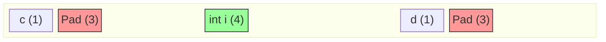

# Machine-Level Programming: Data
{: .no_toc }

Diziler, Structlar, Alignment kuralları ve Bellek Güvenliği.

## İçindekiler
{: .no_toc .text-delta }

1. TOC
{:toc}

---

## 1. Arrays (Diziler)

Bellekte ardışık bloklar halindedir.

*   **Tek Boyutlu:** `T A[L]` $\to$ Başlangıç `x` ise, `i`. eleman `x + i * sizeof(T)` adresindedir.
*   **Çok Boyutlu:** `int A[R][C]` (Row-Major).
    *   `A[i][j]` adresi: `Base + (i * C * 4) + (j * 4)`.
    *   **Kural:** Satır atlamak için sütun sayısını (`C`) bilmek zorundayız.

---

## 2. Structures & Alignment

İşlemciler veriye belirli adres katlarında (4'ün katı, 8'in katı) ulaştığında en yüksek performansı verir. Bu yüzden derleyici aralara **Padding (Boşluk)** ekler.

### Alignment Kuralları (K)

| Tip | Boyut | Kural (Adres % K == 0) |
|:---|:---:|:---|
| `char` | 1 | Her yere gelebilir. |
| `short` | 2 | Adres çift olmalı (sonu 0, 2, 4...). |
| `int`, `float` | 4 | Adres 4'ün katı olmalı. |
| `long`, `double`, `ptr` | 8 | Adres 8'in katı olmalı. |

### Struct Padding Görselleştirmesi

Aşağıdaki struct'ı inceleyelim:
```c
struct S {
    char c;   // 1 byte
    int i;    // 4 byte
    char d;   // 1 byte
};
```
Beklenen: $1+4+1 = 6$ Byte.
Gerçekleşen: **12 Byte!**



1.  `c` (offset 0) yerleşir.
2.  `i` (4 byte) offset 4'e gelmek ister. 0'dan sonra 3 byte **Internal Padding** eklenir.
3.  `d` (offset 8) yerleşir.
4.  Struct'ın toplam boyutu en büyük elemanın katı (4) olmalıdır. 9 byte olmaz $\to$ 12'ye tamamlanır (**External Padding**).

{: .highlight }
> **Optimizasyon:**
> Alanları **Büyükten Küçüğe** sıralarsanız (`int`, `char`, `char`), padding minimize edilir (8 byte olur).

---

## 3. Buffer Overflow (Güvenlik)

C dilinde dizi sınır kontrolü (Bounds Checking) yoktur. Stack taşması, saldırganın program akışını ele geçirmesine neden olabilir.

### Saldırı Mantığı
Stack'te yerel değişkenlerin hemen üzerinde **Return Address** bulunur. Eğer yerel diziye sınırından fazla yazarsanız, dönüş adresini ezip saldırganın koduna (`Exploit Code`) zıplatabilirsiniz.

### Savunma Mekanizmaları

1.  **Stack Canary (Kanarya):**
    *   Return Address ile buffer arasına rastgele bir değer ("Canary") konur.
    *   Fonksiyon bitmeden bu değer kontrol edilir. Değişmişse program `abort` eder.
    *   *Analoji:* Madendeki kanarya ölürse gaz sızıntısı vardır, hemen kaç!
2.  **NX Bit (No-Execute):**
    *   Stack bölgesi "Çalıştırılamaz" olarak işaretlenir. Kod oraya yazılsa bile CPU çalıştırmayı reddeder.
3.  **ASLR (Address Space Layout Randomization):**
    *   Her çalıştırmada stack, heap ve kütüphane adresleri rastgele değiştirilir. Saldırgan zıplayacağı adresi bilemez.

---

## 4. Alıştırmalar (Self-Quiz)

<details>
<summary><strong>Soru 1:</strong> Aşağıdaki struct'ın boyutu kaçtır? (x86-64)<br>
<code>struct { char *p; char c; }</code></summary>
<br>
Cevap: <strong>16 Byte</strong>.
<code>char *p</code> 8 byte yer kaplar.
<code>char c</code> 1 byte kaplar. Toplam 9 byte doludur.
Ancak struct'ın alignment'ı en büyük elemana (8) göre olmalıdır. 9'dan sonraki 8'in katı <strong>16</strong>'dır. Sona 7 byte padding eklenir.
</details>

<details>
<summary><strong>Soru 2:</strong> Stack Canary saldırıyı nasıl engeller?</summary>
<br>
Cevap: Engellemez, sadece <strong>tespit eder</strong>. Buffer taşınca önce Canary değeri bozulur. Program dönüş adresine gitmeden önce "Canary bozuk!" hatası verip güvenli şekilde çöker.
</details>

<details>
<summary><strong>Soru 3:</strong> <code>A[i][j]</code> erişimi için neden sütun sayısı (C) gereklidir?</summary>
<br>
Cevap: Bellek tek boyutludur. 2. satıra geçmek için 1. satırın tamamını (tüm sütunlarını) atlamak gerekir. Formül: <code>Satır * Sütun_Sayisi + Sütun</code>.
</details>
