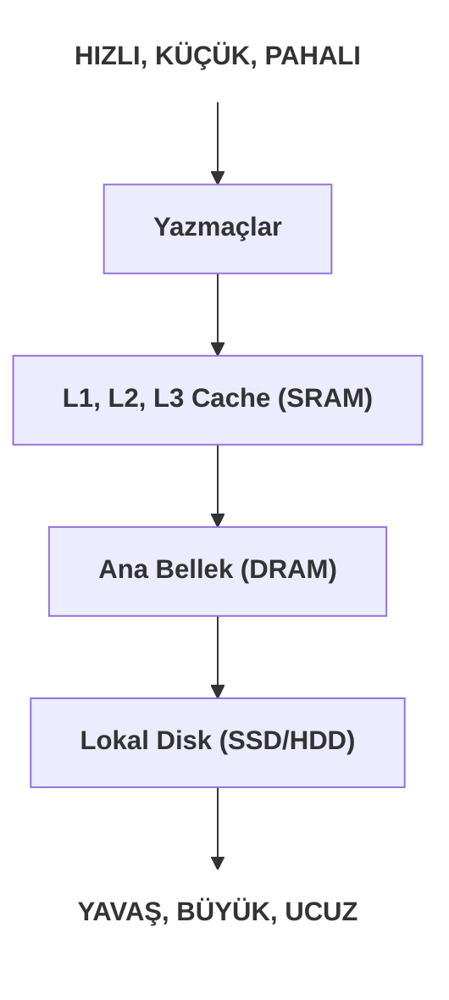

# Bellek Hiyerarşisi ve Önbellekler (Caches)

Modern bir işlemci çok hızlıyken, ana bellek (RAM) ona kıyasla çok yavaştır. Bu devasa hız farkı, "CPU-Bellek Uçurumu" olarak bilinir. Bu bölümde, bu uçurumu kapatmak için tasarlanmış **bellek hiyerarşisini** ve en önemli bileşeni olan **caches (önbellekleri)** inceleyeceğiz.

---

## 1. Depolama Teknolojileri ve Bellek Hiyerarşisi

Farklı bellek türleri, hız, maliyet ve boyut arasında farklı dengeler sunar. Bu teknolojiler, hızlarına göre bir piramit şeklinde organize edilir.



**Temel Fikir:** Her katman, bir altındaki daha yavaş ve daha büyük katman için bir **cache (önbellek)** görevi görür. En sık kullanılan veriler, piramidin en tepesine yakın tutulmaya çalışılır.

<div class="quiz-question">
  <p><b>Soru:</b> Bellek hiyerarşisinin en tepesinde (işlemciye en yakın) ne bulunur ve en temel özelliği nedir?</p>
  <div class="quiz-option">A) DRAM - En yüksek kapasite</div>
  <div class="quiz-option">B) SSD - Kalıcı depolama</div>
  <div class="quiz-option" data-correct="true">C) Registers (Yazmaçlar) - En yüksek hız</div>
  <div class="quiz-option">D) L3 Cache - En iyi maliyet/performans oranı</div>
  <div class="quiz-explanation">
    <p><b>Cevap: C.</b> Hiyerarşinin en tepesinde, işlemcinin kendi içindeki yazmaçlar bulunur. Bunlar en hızlı erişilebilen ancak en küçük kapasiteli bellek türüdür.</p>
  </div>
</div>

---

## 2. Principle of Locality (Yerellik Prensibi)

Bellek hiyerarşisi, programların belleğe genellikle öngörülebilir desenlerle erişmesi sayesinde verimli çalışır. Buna **yerellik prensibi** denir.

### a) Temporal Locality (Zamansal Yerellik)
Eğer bir veriye erişildiyse, yakın gelecekte ona **tekrar** erişilme olasılığı yüksektir.
*   **Örnek:** Bir döngü içindeki sayaç değişkeni.

### b) Spatial Locality (Uzamsal Yerellik)
Eğer bir veriye erişildiyse, onun bellekteki **komşularına** da yakın gelecekte erişilme olasılığı yüksektir.
*   **Örnek:** Bir dizinin elemanlarını sırayla işlemek.

<div class="quiz-question">
  <p><b>Soru:</b> Bir döngü içinde aynı değişkene 1000 defa erişmek, hangi yerellik prensibinin bir örneğidir?</p>
  <div class="quiz-option" data-correct="true">A) Temporal Locality (Zamansal Yerellik)</div>
  <div class="quiz-option">B) Spatial Locality (Uzamsal Yerellik)</div>
  <div class="quiz-option">C) Sequential Locality (Sıralı Yerellik)</div>
  <div class="quiz-option">D) Random Locality (Rastgele Yerellik)</div>
  <div class="quiz-explanation">
    <p><b>Cevap: A.</b> Kısa bir zaman aralığında aynı bellek konumuna (değişkene) tekrar tekrar erişilmesi, zamansal yerelliğin tanımıdır.</p>
  </div>
</div>

---

## 3. Caches (Önbellekler) Nasıl Çalışır?

Önbellek, ana bellekten okunan verileri geçici olarak saklayan küçük ve hızlı bir SRAM belleğidir. Veri, **block (blok)** adı verilen sabit boyutlu parçalar halinde önbelleğe kopyalanır.

*   **Cache Hit (Önbellek Vuruşu):** İşlemcinin aradığı veri önbellekte varsa, çok hızlı bir şekilde alınır.
*   **Cache Miss (Önbellek Iskalama):** Veri önbellekte yoksa, işlemci yavaşlar. Verinin bulunduğu tüm blok, ana bellekten önbelleğe kopyalanır. Bu yavaşlığa **miss penalty (ıskalama cezası)** denir.

**Ana Fikir:** Yerellik prensibi sayesinde, bir kez "miss" yaşayıp bir bloğu önbelleğe getirdiğimizde, o bloktaki diğer veriler için gelecekte yaşanacak erişimler "hit" olacaktır.

---

## 4. Cache-Friendly (Önbellek Dostu) Kod Yazmak

Programlarımızın performansını artırmak için, kodumuzun bellek erişim desenlerini yerellik prensibini güçlendirecek şekilde yazmalıyız.

### Örnek: Matris Toplamı
C dilinde matrisler bellekte **row-major (satır-öncelikli)** olarak (satır satır) saklanır.

```c
// Uzamsal yerelliği MÜKEMMEL
void sum_row_major(int **matrix, int n) {
    for (int i = 0; i < n; i++) {
        for (int j = 0; j < n; j++) {
            sum += matrix[i][j]; // Bellekte sıralı erişim
        }
    }
}

// Uzamsal yerelliği ÇOK KÖTÜ
void sum_col_major(int **matrix, int n) {
    for (int j = 0; j < n; j++) {
        for (int i = 0; i < n; i++) {
            sum += matrix[i][j]; // Bellekte atlamalı erişim
        }
    }
}
```
`sum_row_major` fonksiyonu belleğe sıralı erişim yapar. Bu, mükemmel bir uzamsal yerellik örneğidir. Bir eleman için yaşanan "miss", tüm bir satırı önbelleğe getireceği için o satırdaki diğer elemanlara erişim "hit" olacaktır.

`sum_col_major` ise bellekte birbirinden uzak adreslere atlayarak erişim yapar. Bu, her erişimde yeni bir "cache miss" yaşanmasına neden olabilir ve fonksiyonu diğerine göre **kat kat yavaşlatır**.

<div class="quiz-question">
  <p><b>Soru:</b> Bir programcının yazdığı kodun yavaş çalıştığı tespit ediliyor. Analiz sonucunda, programın "cache miss rate" (önbellek ıskalama oranı) çok yüksek çıkıyor. Programı hızlandırmak için aşağıdakilerden hangisi en etkili yaklaşım olur?</p>
  <div class="quiz-option">A) Daha hızlı bir işlemci (CPU) kullanmak.</div>
  <div class="quiz-option">B) Daha fazla RAM eklemek.</div>
  <div class="quiz-option" data-correct="true">C) Kodun bellek erişim desenlerini, sıralı erişimi (stride-1) artıracak şekilde yeniden düzenlemek.</div>
  <div class="quiz-option">D) Programı daha düşük seviyeli bir dil olan Assembly ile yeniden yazmak.</div>
  <div class="quiz-explanation">
    <p><b>Cevap: C.</b> Yüksek bir "cache miss rate", programın yerellik prensibinden iyi faydalanamadığını gösterir. Bellek erişimlerini daha sıralı ve öngörülebilir hale getirmek (uzamsal yerelliği artırmak), "cache hit rate" (önbellek vuruş oranını) artıracak ve performansı önemli ölçüde iyileştirecektir.</p>
  </div>
</div>

<div class="quiz-question">
  <p><b>Soru:</b> Bir `struct` (yapı) içindeki birden fazla alana art arda erişmek, en çok hangi yerellik prensibinden faydalanır?</p>
  <div class="quiz-option">A) Temporal Locality</div>
  <div class="quiz-option" data-correct="true">B) Spatial Locality</div>
  <div class="quiz-option">C) Her ikisinden de eşit derecede</div>
  <div class="quiz-option">D) Hiçbirinden</div>
  <div class="quiz-explanation">
    <p><b>Cevap: B.</b> Bir `struct`'ın alanları bellekte ardışık olarak yer alır. Bir alana erişildiğinde, o `struct`'ı içeren bellek bloğu muhtemelen önbelleğe yüklenir. Bu sayede, bellekte hemen yanında bulunan diğer alanlara erişim çok daha hızlı olur. Bu, uzamsal yerelliğin tanımıdır.</p>
  </div>
</div>

---
