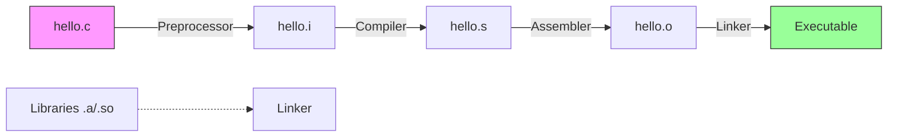
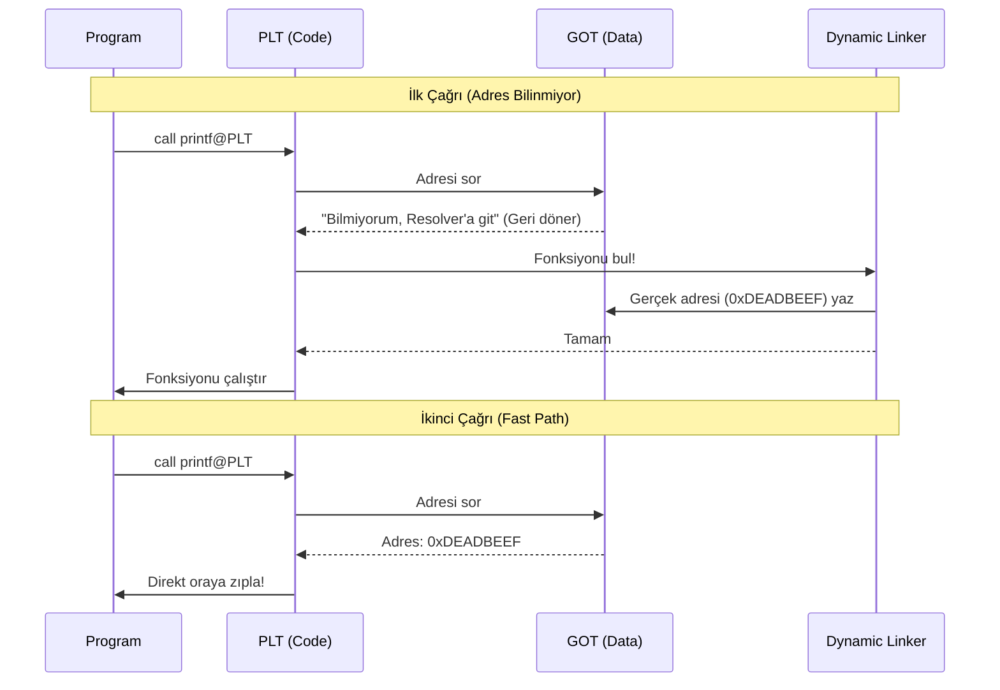

# Linking
{: .no_toc }

Kod parçalarının (`.o`) birleşip çalıştırılabilir programa (`a.out`) dönüşme süreci.

## İçindekiler
{: .no_toc .text-delta }

1. TOC
{:toc}

---

## 1. Derleme Sistemi (The Compilation System)

`gcc hello.c` dediğinizde arka planda 4 araç sırayla çalışır.

1.  **Preprocessor (cpp):** `#include`, `#define` makrolarını işler.
2.  **Compiler (cc1):** C kodunu Assembly koduna çevirir.
3.  **Assembler (as):** Assembly kodunu Binary Object (`.o`) dosyasına çevirir.
4.  **Linker (ld):** Parçaları birleştirir, adresleri düzeltir (Relocation).

---

## 2. Symbols & Resolution

Linker, değişken ve fonksiyon isimlerine (Symbol) bakar.

*   **Global:** `int x = 5;` (Herkes görür).
*   **External:** `extern int x;` (Başka yerde tanımlı).
*   **Local:** `static int x;` (Sadece bu dosyada geçerli, Private).

### Strong vs Weak Symbols

| Tip | Tanım | Örnek |
|:---|:---|:---|
| **Strong** | Fonksiyonlar ve *İlklenmiş* Globaller | `void f() {...}`, `int x = 1;` |
| **Weak** | *İlklenmemiş* Globaller | `int x;` |

### Çakışma Kuralları (Linker Rules)
1.  Aynı isimde birden fazla **Strong** olamaz. (Linker Error: Multiple definition).
2.  Bir Strong, birden çok Weak varsa $\to$ **Strong** seçilir.
3.  Birden çok Weak varsa $\to$ **Rastgele** biri seçilir. (ÇOK TEHLİKELİ!).

{: .warning }
> **Tavsiye:**
> Global değişken kullanmaktan kaçının. Zorundaysanız `static` kullanın veya mutlaka ilk değer verin (Strong yapın).

---

## 3. Static vs Dynamic Linking

*   **Static (`.a`):** Kütüphane kodu derleme anında programa kopyalanır. Dosya büyür, taşınabilirlik artar.
*   **Dynamic (`.so`):** Kütüphane kodu çalışma anında (Run-time) yüklenir. Dosya küçülür, kütüphane güncellenince program da güncellenmiş olur.

---

## 4. PLT & GOT (Lazy Binding)

Paylaşımlı kütüphanelerdeki (Shared Library, örn: `printf`) fonksiyonların adresi program çalışana kadar bilinmez.
Linux, **Lazy Binding** (Tembel Bağlama) kullanır: Fonksiyon **ilk çağrıldığında** adresi çözülür.

### Mekanizma

1.  **GOT (Global Offset Table):** Veri kısmında (`.data`). Adresleri tutar.
2.  **PLT (Procedure Linkage Table):** Kod kısmında (`.text`). Zıplama tahtası.

### Akış Diyagramı

---

## 5. Alıştırmalar (Self-Quiz)

<strong>Soru 1:</strong> İki farklı C dosyasında <code>int x;</code> (global) tanımlanırsa ne olur?

 
Cevap: <strong>Hata vermez (Tehlike!).</strong> İkisi de Weak symbol'dür. Linker keyfi birini seçer ve ikisi de aynı bellek adresini kullanır. Bir dosyadaki değişiklik diğerini bozar.
Çözüm: <code>static int x;</code> veya <code>int x = 0;</code> (Strong) yapın.

<strong>Soru 2:</strong> <code>.bss</code> segmenti diskte yer kaplar mı?

 
Cevap: <strong>Hayır.</strong> BSS (Block Started by Symbol), ilklenmemiş globalleri tutar. Diskte sadece "burada 100 byte yer ayır" bilgisi tutulur, içi sıfır doludur. Executable boyutu büyümez.

<strong>Soru 3:</strong> PLT neden gereklidir?

 
Cevap: Shared Library kodları "Read-Only"dir ve birçok process tarafından paylaşılır. Kodun içine dinamik adres yazılamaz. Bu yüzden değişen adresler GOT (Data) tablosunda tutulur, PLT ise oraya zıplayan sabit kod parçasıdır (Trampoline).

