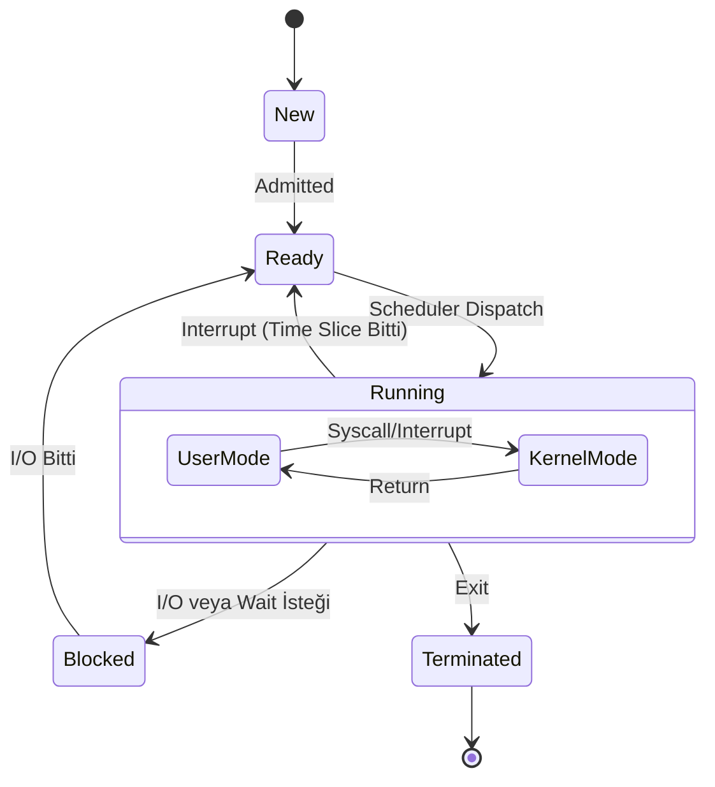

# ECF: Exceptions and Processes
{: .no_toc }

İşletim sisteminin kalbi: Kesmeler (Interrupts), Process yönetimi ve Sistem Çağrıları.

## İçindekiler
{: .no_toc .text-delta }

1. TOC
{:toc}

---

## 1. Exceptions (İstisnalar)

Kontrol akışının ani değişimi. Donanım veya yazılım kaynaklı olabilir.

| Sınıf | Sebep | Async/Sync | Dönüş Davranışı | Örnek |
|:---|:---|:---:|:---|:---|
| **Interrupt** | Dış Sinyal | Async | Sonraki komuta döner. | I/O (Mouse, Network). |
| **Trap** | Kasıtlı | Sync | Sonraki komuta döner. | System Call (`syscall`). |
| **Fault** | Hata (Potansiyel) | Sync | *Aynı* komutu tekrar dener. | Page Fault. |
| **Abort** | Ölümcül Hata | Sync | Dönmez (Abort). | Hardware Failure. |

---

## 2. Processes (Süreçler)

Process, çalışan bir programın soyutlamasıdır. İki illüzyon sunar:
1.  **Exclusive Use of CPU:** Sanki işlemci sadece ona aitmiş gibi. (Context Switch ile sağlanır).
2.  **Private Address Space:** Sanki tüm hafıza ona aitmiş gibi. (Virtual Memory ile sağlanır).

### Process Durum Diyagramı (State Diagram)

Bir process hayatı boyunca bu durumlardan geçer:



---

## 3. Process Control: `fork()`

Yeni process yaratmanın Unix yolu.
*   **Kural:** `fork()` **BİR KERE** çağrılır, **İKİ KERE** döner.
*   **Parent:** Child'ın PID'sini alır.
*   **Child:** `0` alır.

### Çalışma Mantığı
`fork` çağrıldığı an, parent'ın birebir kopyası (hafıza, değişkenler, fd tablosu) oluşturulur. Ancak bunlar **ayrı** alanlardır. Birinin değişken değiştirmesi diğerini etkilemez (Copy-on-Write mekanizması sayesinde verimli yapılır).

### Kod Örneği
```c
int main() {
    pid_t pid = fork();
    
    if (pid == 0) {
        printf("Ben Çocuğum!\n");
        exit(0);
    } else {
        printf("Ben Ebeveynim, çocuğumun PID'si: %d\n", pid);
        wait(NULL); // Çocuğun ölmesini bekle (Reap)
    }
}
```

{: .warning }
> **Zombie Process:**
> Eğer Parent `wait()` çağırmadan ölürse veya çocuğu "reap" etmezse, ölen çocuk process tablosunda "Zombi" (`defunct`) olarak kalır. Kaynak tüketir.

---

## 4. Context Switch (Bağlam Değişimi)

OS, bir process'i durdurup diğerini çalıştırırken:
1.  Mevcut registerları, PC'yi ve durumu kaydeder.
2.  Yeni process'in kayıtlı durumunu yükler.
3.  Cache kirlendiği için (Cache Pollution) maliyetli bir işlemdir.

---

## 5. Alıştırmalar (Self-Quiz)

<details>
<summary><strong>Soru 1:</strong> Aşağıdaki kod kaç satır "Hello" basar?<br>
<code>fork(); fork(); printf("Hello\n");</code></summary>
<br>
Cevap: <strong>4 Satır.</strong>
1. İlk fork: P -> P, C1 (2 Process)
2. İkinci fork: İkisi de forklar. P->C2, C1->C3. (Toplam 4 Process).
Her biri print'e gelir.
</details>

<details>
<summary><strong>Soru 2:</strong> <code>execve</code> fonksiyonu hata vermezse geriye ne döner?</summary>
<br>
Cevap: <strong>DÖNMEZ.</strong>
Başarılı olursa, mevcut process'in kod alanı tamamen yeni programla değiştirilir. Eski programdan eser kalmaz, dolayısıyla "geri dönecek" bir yer yoktur. Sadece hata olursa -1 döner.
</details>

<details>
<summary><strong>Soru 3:</strong> Fault ve Abort arasındaki fark nedir?</summary>
<br>
Cevap: Fault (örn: Page Fault) düzeltilebilir bir hatadır, OS sayfayı yükleyip komutu <strong>tekrar dener</strong>. Abort (örn: RAM hatası) düzeltilemez, program sonlandırılır.
</details>
