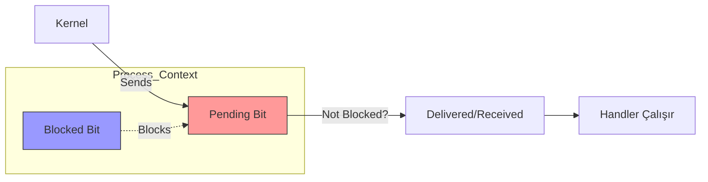

# ECF: Signals and Nonlocal Jumps
{: .no_toc }

Yazılımsal kesmeler (Software Interrupts) ve güvenli sinyal işleme teknikleri.

## İçindekiler
{: .no_toc .text-delta }

1. TOC
{:toc}

---

## 1. Signals (Sinyaller)

Processlere gönderilen küçük mesajlardır (sadece ID taşır).

| Signal | İsim | Default Action | Olay |
|:---:|:---|:---|:---|
| 2 | `SIGINT` | Terminate | **Ctrl+C** (Interrupt) |
| 9 | `SIGKILL` | Terminate | **Kill Immediately** (Durdurulamaz!) |
| 11 | `SIGSEGV` | Dump Core | Segmentation Fault (Hatalı bellek) |
| 14 | `SIGALRM` | Terminate | Timer süresi doldu |
| 17 | `SIGCHLD` | Ignore | Child process öldü |

---

## 2. Signal Life Cycle (Yaşam Döngüsü)

Bir sinyal gönderildiğinde hemen işlenmeyebilir.



*   **Pending:** Gönderilmiş ama henüz alınmamış sinyal. (Her türden en fazla 1 tane olabilir! Kuyruk yoktur).
*   **Blocked:** Process'in "Şu an meşgulüm, bu sinyali beklet" demesi. (`sigprocmask`).

---

## 3. Güvenli Sinyal İşleme (Handler)

Sinyal yakalamak için `signal()` veya `sigaction()` kullanılır. Ancak Handler yazmak zordur.

### Altın Kurallar

1.  **Keep it Simple:** Mümkünse sadece bir bayrak (flag) set et ve çık.
2.  **Async-Signal-Safety:** Sadece güvenli fonksiyonları çağır (`write`, `_exit`, `strlen`).
    *   ❌ `printf`, `malloc`, `exit` **YASAKTIR!** (Deadlock veya Heap bozulması riski).
3.  **Save `errno`:** Handler başında `errno`'yu kaydet, çıkarken geri yükle.
4.  **Volatile:** Ana programla paylaşılan değişkenler `volatile sig_atomic_t` olmalıdır.
    *   `volatile`: "Derleyici! Bu değişken her an değişebilir, sakın register'a optimize etme, hep RAM'den oku."

```c
volatile sig_atomic_t flag = 0;

void handler(int sig) {
    flag = 1; // Güvenli
}
```

---

## 4. Nonlocal Jumps (`setjmp` / `longjmp`)

C dilinde `goto` sadece fonksiyon içine zıplar. `setjmp/longjmp` ise fonksiyonlar arası zıplar (Stack'i deler geçer). Exception Handling (Try-Catch) mekanizmasının atasıdır.

*   **`setjmp(env)`:** "Buraya bir checkpoint koy." (0 döner).
*   **`longjmp(env, val)`:** "Checkpoint'e geri dön!" (val döner).

{: .warning }
> **Dikkat:**
> `longjmp` yapıldığında, aradaki fonksiyonların stack frame'leri yok edilir ama **destructor** gibi temizlik işlemleri (C++ olmadığı için) çalışmaz. Memory leak riski vardır.

---

## 5. Alıştırmalar (Self-Quiz)

<details>
<summary><strong>Soru 1:</strong> Bir process'e ardı ardına 5 tane <code>SIGINT</code> gönderilirse handler kaç kere çalışır?</summary>
<br>
Cevap: <strong>Garanti Değil (Genelde 1 veya 2).</strong>
Linux sinyalleri <strong>kuyruğa atmaz (No Queuing)</strong>. Sinyal handler çalışırken gelen aynı tip sinyaller "Pending" bitini set eder. 1 tane pending olabilir. Handler bitince o işlenir. Arada gelen diğer 3 sinyal <strong>kaybolur</strong>.
</details>

<details>
<summary><strong>Soru 2:</strong> <code>SIGKILL</code> sinyalini yakalayıp (catch) "Kapanmıyorum!" diyebilir miyiz?</summary>
<br>
Cevap: <strong>HAYIR.</strong>
<code>SIGKILL</code> (9) ve <code>SIGSTOP</code> (19) sinyalleri kernel tarafından zorla uygulanır. Yakalanamaz, bloklanamaz veya ignore edilemez.
</details>

<details>
<summary><strong>Soru 3:</strong> Handler içinde neden <code>printf</code> kullanılmaz?</summary>
<br>
Cevap: <code>printf</code> thread-safe değildir ve içerde kilit (lock) tutabilir. Ana program <code>printf</code> içindeyken sinyal gelirse ve handler da <code>printf</code> çağırırsa, aynı kilidi beklerken <strong>Deadlock</strong> (Kilitlenme) oluşur.
</details>
